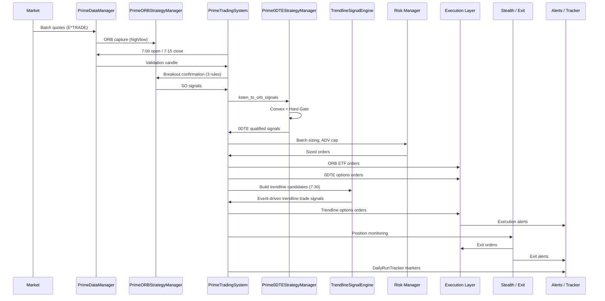
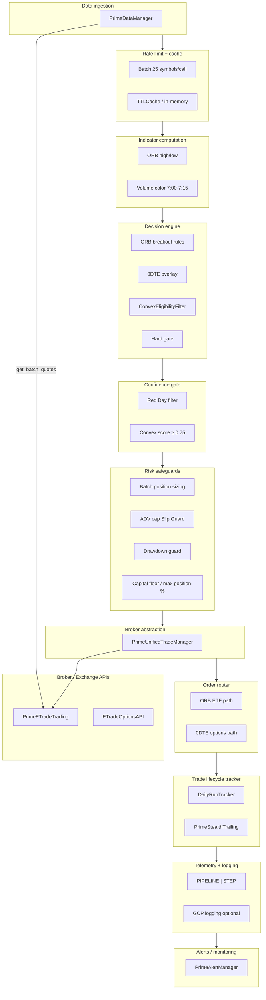

# Easy ORB 0DTE Strategy

**Automated three-strategy system: ORB ETF Standard Orders, ORB 0DTE Options, and Easy Trendline 0DTE Options—with shared ORB capture, isolated strategy ledgers, multi-layer risk controls, and full-day monitoring/exits.**

---

### **New here?**

| Goal | Where to go |
|------|-------------|
| **Run or deploy the app** | [Quick Start](#-quick-start) |
| **Understand the system** | [System Overview](#-system-overview) · [How It Works](#-how-it-works) |
| **Full documentation** | [Documentation](#-documentation) · [docs/README.md](docs/README.md) (docs index) |
| **Cloud deploy & URLs** | [docs/CloudSecrets.md](docs/CloudSecrets.md) · [Cloud Optimization Strategy](docs/Cloud.md#cloud-deployment-optimization-strategy) |
| **Daily flow & rules** | [ProcessFlow.md — Daily Performance Flow](docs/ProcessFlow.md#-daily-performance-flow--steps-the-software-takes) · [SignalRulesChecklist.md](docs/doc_elements/Sessions/2026/Feb24%20Session/SignalRulesChecklist.md) |
| **Cloud Scheduler jobs** | [CLOUD_JOBS_CHECKLIST.md](docs/doc_elements/Sessions/2026/Feb24%20Session/CLOUD_JOBS_CHECKLIST.md) — 7 required jobs (keepalives, 7:00 validation, 7:15 prefetch, EOD); verify/resume there. |

---

### **Version & status**

| Item | Value |
|------|--------|
| **Version** | **Rev 00351** (May 6, 2026 docs sync) **+ May 15, 2026 local pass** (`BUILD_ID` `00349-20260515-may15-calibration-so-json-symbols`): Trendline impulse calibration (R1–R6), SO `json` ranking fix + batch dedupe `bool`, CISCO/NEBIUS aliases, execution policy layer (smart limits off until `USE_MARKET_ORDERS=false`); **prod still `easy-etrade-strategy-00330-zdt` until deploy** — [May 15 session](docs/doc_elements/Sessions/2026/May15%20Session/SESSION_SUMMARY_MAY15_2026.md). **+ May 13, 2026 doc refresh:** ORB 0DTE pre-queue / lifecycle / selector calibration and **`OPTION_STEALTH_ORB_*`** / EOD flatten telemetry (see **`docs/0DTEORB.md`** and May 13 session summary); **RGC** and **CGON** removed from tradable **`core_list` / `0dte_list`** (strategy + collector); ORB SO ETF **Demo/Live stealth rehydrate** at **`start()`** and **`PrimeUnifiedTradeManager.close_position`** for health/EOD broker-only closes. ORB SO ranking refinement (continuation-quality, `SO_RANK_BREAKDOWN`, etc.) unchanged. ORB 0DTE monitor baseline remains ~7s with adaptive throttling. Watchlists stay dynamic — **tier counts change with curation** (verify `0dte_list.csv`, do not rely on stale “Tier 1 = 9” examples in older prose). |
| **Status** | ✅ **Production Ready** — Three concurrent strategy paths |
| **Trading modes** | DEMO (Live ready when needed) |
| **Broker** | E*TRADE (default), Interactive Brokers, Robinhood (placeholders) |
| **Data** | **Broker-only** (no third-party sources) |
| **0DTE** | ✅ Production — alpha-only priority ranking + viability prefiltering + staged fallback routing (Apr 24, 2026) |
| **Cloud** | ✅ Automated weekly cleanup; scripts deployed with app (Rev 00294); [Optimization Strategy](docs/Cloud.md#cloud-deployment-optimization-strategy) |

**May 5, 2026 updates**: README version table and watchlist counts aligned to `data/watchlist/*.csv` and seven-file `config_loader` merge order (see **Settings.md**). **May 4, 2026 updates**: **EOD** — three-path flatten (`flatten_all_paths_for_eod_scheduler`), `SO_ETF_EOD_CLOSE_*` PT window, Cloud Scheduler `/api/end-of-day-report` dedupe; docs updated in README, **Strategy.md**, **Settings.md**, **Alerts.md**, **0DTETrendline.md**, **0DTEORB.md**. options-stealth observability and live-quote controls were expanded. `OPTION_PRICE_RESOLUTION_AUDIT` is now throttle-controlled via `OPTION_PRICE_RESOLUTION_AUDIT_MIN_SECONDS` (default 30s), strict live-quote production guidance is documented (`OPTION_REQUIRE_LIVE_QUOTES=true` in template), and degraded live-quote impact telemetry is now explicit through `OPTION_DEGRADED_LIVE_QUOTE`, session counters (`degraded_quote_count`, `degraded_exit_count`, `skipped_entry_due_to_no_quote`), and summary metric `live_quote_availability_pct`. **Open-position fast monitors** for ORB 0DTE and Trendline 0DTE options now default to **7s** (`ORB_0DTE_POSITION_MONITOR_INTERVAL_SEC`, `TRENDLINE_POSITION_MONITOR_INTERVAL_SEC`) to reduce baseline API pressure; dynamic interval scaling is unchanged. **Config & docs:** **`configs/ORB0DTE.env`** now pins the full ORB 0DTE tunable surface (delta ladder, strategy tiers, chain health, monitors, executor stops, `OPTION_0DTE_*`); **`configs/Trendline0DTE.env`** corrected loader key names; **[docs/0DTEORB.md](docs/0DTEORB.md)** and **[docs/0DTETrendline.md](docs/0DTETrendline.md)** gained merge-order + **appendix snapshots** of those env files; **[docs/ORB0DTE_Path_Settings_Review.md](docs/ORB0DTE_Path_Settings_Review.md)** added for grouped review tables. Session note: [May4 Session](docs/doc_elements/Sessions/2026/May4%20Session/SESSION_SUMMARY_MAY04_2026.md).

**April 24, 2026 updates**: ORB 0DTE now enforces corrected ITM classification (CALL ITM below spot, PUT ITM above spot), adds chain-fetch retry + chain-health precheck + viability scoring as a pre-queue feasibility filter, and applies explicit fallback-stage tracing (`ITM_SPREAD_PRIMARY` -> `ITM_SPREAD_RELAXED` -> `ATM_SPREAD` -> `SINGLE_LEG` -> `FINAL_REJECT`). Ranking remains alpha-only (`priority_score`) with viability used as filter (and optional tie-breaker) only. Overextension rejection, directional concentration diagnostics, and execution summary metrics were also added for optimization telemetry. Trendline 0DTE now supports pullback-continuation entries for high-strength breakouts (with anti-chop protection retained) and adds near-boundary contract delta tolerance via `TRENDLINE_DELTA_TOLERANCE` plus `TRENDLINE_DELTA_TOLERANCE_USED` diagnostics.

**April 28, 2026 updates**: Trendline 0DTE entry logic now supports delayed re-arm, market-regime filtering, impulse mode, slow-trend mode, early-entry sizing, retest handling, and a shared expansion-quality/min-expected-move gate. Trendline options stealth monitoring now uses outage-based degraded-data safety (`OPTION_STEALTH_NO_DATA_OUTAGE_SECONDS`), premium-source priority (`option_mid -> option_last -> cache -> delta_estimate`), and explicit observability markers (`0DTE_RUNTIME_CONFIG`, `OPTIONS_DATA_SOURCE_UPDATE`, `OPTIONS_DATA_FALLBACK_USED`, `OPTIONS_DATA_OUTAGE`) to validate deploy parity.

**April 30, 2026 updates**: Easy Trendline 0DTE **documentation + telemetry alignment** — unified **`TRENDLINE_DECISION_SNAPSHOT`** fields for tuning (read-only **`confidence_score`**, **`line_quality`**, **`source`**, minutes-from-7:30 / structure-shift-to-break), **`TRENDLINE_DECISION_GEOMETRY_DETAIL`** for intrabar geometry (separate schema), canonical **`TRENDLINE_SKIP_REASON`** buckets with **`raw_reason`** when remapped, **`TRENDLINE_FALLBACK_USED`** on builder anchor fallbacks and signal-engine move derivation, prebuilt/low-confidence and candidate-expiry markers, pressure touch spacing (**`TRENDLINE_MIN_TOUCH_BAR_GAP`**), strict break thresholds (**`TRENDLINE_STRICT_MIN_*`**) with high-pressure body relaxation, **`TRENDLINE_MISSED_WIN`** / **`TRENDLINE_BAD_ENTRY`**, and log-only **`TRENDLINE_ALERT | type=high_skip_rate`**. **7:30 trendline setup selection** is **structure-first**: **`TrendlineBuilder.classify_orb_test_failure`** picks bull vs bear when **`failed_downside` / `failed_upside`** apply; **`trend_continuation`** skips setup; unclear/compression cases use **MSE** (and anchor-span tie-break); the old **price-at-7:30 vs ORB** distance rule is disabled — see **`TRENDLINE_SELECTOR_STRUCTURE_OVERRIDE`**, **`TRENDLINE_SETUP_SKIP`**, **`TRENDLINE_TREND_CONTINUATION_SKIP`** in [docs/0DTETrendline.md](docs/0DTETrendline.md); also [docs/Settings.md](docs/Settings.md) and session note [April30 Session](docs/doc_elements/Sessions/2026/April30%20Session/SESSION_SUMMARY_APR30_2026.md).

---

## 🎯 **System Overview**

**Easy ORB Strategy** runs a **three-path automated trading system** combining:

1. **Easy ORB Strategy (ETF SO)**: opening-range breakout ETF/stock path with 7:30 AM PT execution.
2. **Easy 0DTE Strategy (ORB Options)**: Convex-filtered 0DTE options path tied to ORB signal collection, executed at 7:30 AM PT.
3. **Easy Trendline 0DTE Strategy (Options)**: independent trendline path built at 7:30 AM PT from the full 0DTE universe, then event-driven execution after break + structure + momentum confirmation.

**Core Philosophy**: 
- **ORB Strategy**: Trade breakouts from the first 15 minutes of market action
- **0DTE Strategy**: *Not every ORB-qualified trade gets options—only the highest-conviction setups.*
- **Easy 0DTE = Selective Convex Amplification. Gamma > Leverage.**

---

### Centralized observability (ORB SO — Phase 3)

**Easy ORB SO** emits live telemetry into the shared [**Observability**](../Observability/) platform (`0. Strategies and Automations/Observability/`).

| Layer | Role |
|-------|------|
| **PostgreSQL** | Source of truth — `trades`, `signals`, `equity_snapshots`, `lifecycle_events` |
| **Grafana** | Visualization only (dashboards planned; not required for telemetry) |
| **This app** | Writes via `observability.py` → `ObservabilityClient` |

**Wired events (ORB SO only):** signal collection, trade open/close (demo path), major lifecycle (`signal_generated`, `trade_opened`, `trade_closed`, `risk_rejected`), periodic equity snapshots (~60s).

**Env vars:** `OBSERVABILITY_DATABASE_URL` (or `DATABASE_URL`), `OBSERVABILITY_ENABLED` (default `true`), `STRATEGY_NAME` / `STRATEGY_GROUP` / `DEPLOYMENT_PROJECT` / `ENVIRONMENT` / `EXECUTION_MODE`. Install `psycopg2-binary` (see `../Observability/requirements.txt`).

ORB 0DTE, Trendline 0DTE, and Kalshibot are **not** wired yet.

---

### Three-Strategy Integration (phases)

```
┌─────────────────────────────────────────────────────────────┐
│                 Easy ORB 0DTE Strategy                      │
│     (ORB ETF + ORB 0DTE + Trendline 0DTE Options)           │
├─────────────────────────────────────────────────────────────┤
│  Phase 1: ORB Capture (6:30-6:45 AM PT) - SHARED          │
│  Phase 2: Signal Collection & Rules (7:15-7:30 AM PT)       │
│  Phase 3: Multi-path execution (7:30 + event-driven)      │
│  Phase 4: Position Monitoring (Throughout Day)             │
└─────────────────────────────────────────────────────────────┘
```

## 📊 **Proven Performance**

### **Historical Validation - 11 Days Real Market Data (October 2024)**

**Overall Results:**
- **Weekly Return**: +73.69% (23% above +60% target)
- **Winning Days**: 10/11 (91% consistency)
- **Max Drawdown**: -0.84% (96% reduced from -21.68%)
- **Profit Factor**: 194.00 (vs 2.03 baseline)
- **Monthly Projection**: +508% (compounded)

**By Day Type Performance:**
| Type | Days | Baseline | Improved | Improvement |
|------|------|----------|----------|-------------|
| POOR | 3 | -49.75% | **+0.69%** | **+50.44%** |
| WEAK | 3 | -12.73% | **+3.08%** | **+15.81%** |
| GOOD | 3 | +57.12% | **+56.93%** | Preserved ✅ |

**Account Size Scaling:**
- **$1,000**: +73.69% weekly (validated)
- **$5,000**: +65-75% weekly (projected)
- **$50,000**: +60-70% weekly (projected)

---

### Key components

| Layer | ORB ETF | ORB 0DTE + Trendline 0DTE / shared |
|-------|-----|----------------|
| **Decision** | PrimeORBStrategyManager | Prime0DTEStrategyManager, ConvexEligibilityFilter |
| **Risk** | PrimeRiskManager / PrimeDemoRiskManager (batch sizing, ADV, drawdown) | Same risk layer; 0DTE position sizing in Prime0DTEStrategyManager |
| **Execution** | MockTradingExecutor (demo), PrimeUnifiedTradeManager + PrimeETradeTrading (live) | ORB 0DTE: OptionsChainManager + Mock/Live options executor; Trendline 0DTE: dedicated TrendlineOptionsExecutor + dedicated TrendlineAccountManager |
| **Monitoring** | `PrimeStealthTrailing` (14 ETF exit triggers) | **Shared** `prime_options_stealth_trailing_tp` (`orb_options_stealth` / `trendline_options_stealth`) when wired, registration preferring valid **`normalized_options`**; plus ORB 0DTE lifecycle rules; Trendline uses a faster monitor interval and isolated ledger |
| **Data** | PrimeDataManager (get_batch_quotes), PrimeMarketManager | GCS persistence (validation candle, signal collection) |
| **Observability** | PrimeAlertManager (Telegram), DailyRunTracker (GCS markers), `PIPELINE` logging, **`SO_PIPELINE` grep** (per-stage SO drops/diffs/rank snapshots) | Same + `TRENDLINE_PIPELINE` (**`request_summary`**, **`build_summary`** with timing, **`build_context`**, **`build_degraded`**, **`build_bar_diagnostics`**) + **`TRENDLINE_DECISION_SNAPSHOT`** / canonical **`TRENDLINE_SKIP_REASON`** / pressure & fallback markers (see [0DTETrendline.md](docs/0DTETrendline.md)) and trendline feature snapshots (`data/trendline_optimizer/`) |

---

## 🔄 Trade Lifecycle Flow



---

## 🎯 **How It Works**

### **ORB ETF Trading Flow**

#### **Phase 1: ORB Capture (6:30-6:45 AM PT / 9:30-9:45 AM ET)**
- Capture opening range (high/low) for **all symbols** (ORB + 0DTE):
  - **ORB symbols**: dynamic row count from `core_list.csv`
  - **0DTE symbols**: dynamic row count from `0dte_list.csv`
  - **Total**: dynamic merged unique universe (union of both lists)
- Triggered **at 6:45 AM PT** (ensures complete 6:30-6:45 range)
- Method: **E*TRADE batch quotes ONLY** (today's OHLC = ORB high/low) - Rev 00236
- **ORB range % (Rev 00311–00312):** For each symbol, opening-range **high = max(high)** and **low = min(low)** over the 6:30–6:45 window when multiple bars exist. **orb_range_pct** = \((\text{ORB high} - \text{ORB low}) / \text{ORB low} × 100\) — same number for LONG/SHORT, Convex, priority ranking, and opening bar protection. If capture is degenerate (~0%), a **recovery pass** re-fetches multi-bar 15m and re-captures.
- **No Fallback**: System stops if broker fails (no third-party backup)
- Processing: 2-5 seconds for all symbols
- Data stored for entire trading day
- **Fully dynamic**: Add/remove symbols without code changes (both ORB and 0DTE)

#### **Phase 2: Signal Collection & Rules Confirmation (7:15-7:30 AM PT / 10:15-10:30 AM ET)** ⭐ PRIMARY

**Required Cloud Scheduler jobs (7):** keepalive-1/2/3, oauth-market-open-alert, **validation-candle-700** (7:00 AM PT), **prefetch-validation-715** (7:15 AM PT), end-of-day-report. All must be ENABLED. List/resume: [CLOUD_JOBS_CHECKLIST.md](docs/doc_elements/Sessions/2026/Feb24%20Session/CLOUD_JOBS_CHECKLIST.md).

**Signal rules at a glance (validation candle = 7:00–7:15 AM PT only):**
- **ORB LONG / 0DTE CALL (all 3):** Price ≥ ORB high×1.001; volume GREEN (7:15 close > 7:00 open); 7:00–7:15 close > ORB high.
- **ORB SHORT / 0DTE PUT (all 3):** Price ≤ ORB low×0.999; volume RED (7:15 close < 7:00 open); 7:00–7:15 close < ORB low.
- **Why 0 signals:** All NEUTRAL → fix 7:00 + 7:15 jobs and GCS. Validation OK but 0 signals → no symbol had bar close above ORB high (LONG) or below ORB low (SHORT); check logs for rule breakdown. **0DTE 0 qualified:** Convex filter rejected all → grep `CONVEX_FILTER | 0_eligible` for check-by-check failure counts; after Convex, trace drops with `CONVEX_REJECT_DETAIL`, `0DTE_PIPELINE`, `0DTE_HARD_GATE_REJECT`, `0DTE_EXEC_REJECT`. Full rules and diagnosis: [SignalRulesChecklist.md](docs/doc_elements/Sessions/2026/Feb24%20Session/SignalRulesChecklist.md), [SESSION_SUMMARY_FEB26_2026.md](docs/doc_elements/Sessions/2026/Feb26%20Session/SESSION_SUMMARY_FEB26_2026.md).

**ORB Strategy - SO Signal Collection:**
- **7:00 open**: Cloud Scheduler job `validation-candle-700` captures 7:00 open (batched 25/call), persisted to GCS. **7:15 prefetch**: Trading loop or scheduler job `prefetch-validation-715` builds 7:00 open + 7:15 close → GREEN/RED (E*TRADE batch quotes - Rev 00236).
- **Scanning**: Continuous validation every 30 seconds (15-minute window)
- **Validation**: 3 strict rules (price, volume color, validation candle close vs ORB high/low)
- **Rules Confirmation**: After ORB Capture, confirms all rules before execution
- **Risk Management**: Position sizing, capital allocation, rank-based multipliers
- **7:30 Cutoff Revalidation (Rev 00330/00331):** Right before the Signal Collection alert + Step 5 ranking/execution, pending candidates are re-checked using **fresh quotes**. ORB/0DTE LONG candidates are kept only if `current_price_now >= ORB high * 1.001` (+0.1% buffer), and 0DTE SHORT candidates only if `current_price_now <= ORB low * 0.999` (-0.1% buffer). This prevents drift from earlier 7:15–7:30 scans from incorrectly keeping near-threshold symbols in the final list.
- **Final Collection**: Up to **15 confirmed SO ETF trades** at 7:30 execution (after all rules and risk management; `MAX_CONCURRENT_TRADES`)
- **Ranking**: Multi-factor priority scoring (VWAP 27%, RS vs SPY 25%, ORB Vol 22%)
- **Data Source**: **E*TRADE batch quotes ONLY** (2-5 seconds vs 131.6s with third-party)

**0DTE Strategy - Options Signal Collection:**
- **Same rule stack as ORB for direction**: **LONG (CALL)** = identical three rules as ORB Long (price ≥ ORB high×1.001, GREEN 7:00–7:15 candle, that bar’s close > ORB high). **SHORT (PUT)** = inverse (price ≤ ORB low×0.999, RED candle, close < ORB low). Symbols appear on the 0DTE signal list **only** if they pass the corresponding stack — no price-only bypass.
- **ORB Signal Collection list** = `core_list` symbols that pass **Long** rules (**ORB SO** execution). Symbols **only** on `0dte_list` never append here until added to `core_list` (RS vs SPY and SO ranking apply only to **core** symbols). Core is mostly **leveraged ETFs**; selected **spot equities** may be dual-listed on both CSVs when ORB SO should trade the stock (e.g. **HIMS**, **CRWD**, **NVDA** — verify `core_list.csv`). Additional NVIDIA SO exposure may also use **2×** names (NVDD, NVDL, NVDQ, NVDX) on `core_list`.
- **0DTE Signal Collection list** = `0dte_list` (plus scan universe) symbols that pass **Long Call** rules and/or **Short Put** rules, same gates as above.
- **After lists**: **Convex** (0DTE only) and **Hard Gate** refine which 0DTE names reach options execution. Convex **ORB range** check uses morning **orb_range_pct** (not a separate formula). **ORB ETF execution** uses the SO list from signal collection **without** Convex.

**Signal Collection Alert (7:30 AM PT):**
- **Single Alert** showing both SO Signal Collection and 0DTE Signal Collection
- **SO Signal Collection**: Final confirmed SO trades list (after all rules and risk management)
- **0DTE Signal Collection**: Ranked 0DTE candidate list (CALL + PUT) plus pipeline diagnostics
- **0DTE Pipeline diagnostics** shown in alert: `candidates`, `convex`, `hard_gate`, `pending_exec`
- **Execution-ready for 0DTE** is the final `pending_exec` set after Convex + Hard Gate + ranking/cap

#### **Phase 3: Multi-Path Trade Execution (7:30 AM PT / 10:30 AM ET)** ⭐ PRIMARY

**ORB SO Execution:**
- **Execution**: Trades from **SO Signal Collection** (final confirmed list) executed simultaneously
- **Position Sizing**: Rank-based multipliers (3.0x, 2.5x, 2.0x...) already applied during Signal Collection
- **Capital Deployment**: 90% allocation via normalization (already calculated)
- **Trade Limit**: Maximum **15** simultaneous SO **ETF** executions at 7:30 (`MAX_CONCURRENT_TRADES` in `configs/ORBSO.env`; separate from 0DTE/Trendline caps)
- **Capital Efficiency**: 85-93% with whole shares
- **Execution Alert**: **Separate ORB SO Execution alert** sent with executed trades

**0DTE Options Execution:**
- **Signal Collection**: 0DTE produces **both Long (CALL) and Short (PUT)** signals (unlike ORB SO, which is Long-only). Combined list is ranked by priority; top N (max **6** concurrent at 7:30, `0DTE_MAX_POSITIONS`) are executed as options. Full path: [ProcessFlow.md](docs/ProcessFlow.md#0dte-strategy--from-signal-collection-list-to-execution-and-monitoring), [Strategy.md](docs/Strategy.md), [easy0DTE/docs/Strategy.md](easy0DTE/docs/Strategy.md).
- **Execution**: Trades from **0DTE Signal Collection** (Convex + Hard Gate → `_pending_dte0_signals`) executed as CALL and PUT options; **collection row count** (e.g. 34 CALL+PUT lines) is larger than **execution attempts** when Convex/Hard Gate/cap trim the queue—execution alert summarizes both.
- **Options Chain**: **LIVE and DEMO:** E*TRADE per symbol with 0DTE expiry resolved in **US/Eastern** trading day. Synthetic demo chains are disabled in production config (`0DTE_DEMO_SYNTHETIC_CHAIN=false`), and live broker chain/quote data is required (`REQUIRE_LIVE_OPTION_DATA=true`).
- **Strike Selection**: Already validated during Signal Collection (delta 0.15–0.35, premium $0.15–$0.60, liquidity)
- **Position Sizing**: Tier 1 (top 3) 35%, Tier 2 (next 5) 20%, Tier 3 rest 10%; concurrent cap **6** (CALL + PUT combined)
- **Trade Limit**: Maximum **6** concurrent ORB 0DTE option positions at 7:30 (`0DTE_MAX_POSITIONS`; combined ORB 0DTE + Trendline opens also bounded by `MAX_TOTAL_OPTION_POSITIONS`)
- **Execution Alert**: **Separate 0DTE Options Execution alert** sent with executed trades

**Easy Trendline 0DTE Execution:**
- **Build at 7:30 AM PT**: Trendline candidates are created from the **full 0DTE universe** (watchlist order preserved). **Data:** `PrimeDataManager.get_batch_intraday_data(..., bars=1)` supplies an **ORB-timed** bar; **`get_batch_quotes`** is merged in the same pass so structure has **two distinct timestamps** (broker-only path does **not** return true multi-bar history when `bars>1`). Fetches run in **chunks** (default 25 symbols) with **configurable batch-call budgets** and optional **partial build** when degradation is enabled—see **`TRENDLINE_*`** budget keys in [Settings.md](docs/Settings.md) and [0DTETrendline.md](docs/0DTETrendline.md).
- **Setup geometry (bull vs bear / call vs put):** **`classify_orb_test_failure`** on the post-ORB→7:30 window is the **primary** selector (failed downside → descending resistance / call; failed upside → ascending support / put; trend continuation → no candidate); when classification does not pin a side, **`select_pre730_structure_setup`** falls back to **MSE** among both built lines. The retired **ORB distance** heuristic is not used — details and log tokens in [0DTETrendline.md](docs/0DTETrendline.md).
- **No immediate 7:30 entry**: executions occur only after post-build break/hold/structure/momentum confirmation.
- **Cap and sizing**: rolling concurrent cap via `TRENDLINE_MAX_OPEN_POSITIONS` (default 5), slot-based capital sizing from trendline account allocation, and refill-on-exit behavior (next ready Trendline signal can execute when a slot opens).
- **Account isolation**: dedicated trendline demo ledger and position lifecycle separate from ORB ETF and ORB 0DTE ledgers.
- **Execution Alert**: separate Trendline 0DTE execution alerts sent when confirmations occur intraday.

**Note**: Both execution alerts sent **after** trades are executed. The Signal Collection alert contains the **final confirmed trade lists** ready for execution (after all rules and risk management).

#### **Phase 4: Position Monitoring (Throughout Day)**
- **Opening Bar Protection (ORB ETF):** Initial stop tiers use **morning ORB range %** when ORB data is present (same `orb_range_pct` as capture), so protection aligns with priority/Convex. See [Risk.md](docs/Risk.md#opening-bar-protection--orb-range).
- **Frequency**: Main loop heartbeat remains on the order of **30 seconds** for orchestration and ORB ETF stealth; **ORB 0DTE** and **Trendline 0DTE** option books additionally use dedicated **~7s** fast monitors (`ORB_0DTE_POSITION_MONITOR_INTERVAL_SEC`, `TRENDLINE_POSITION_MONITOR_INTERVAL_SEC`) with shared-loop backup and dynamic backoff under load.
- **Breakeven**: Auto-activate at +0.75% profit after 6.4 min
- **Trailing**: Dynamic 1.5-2.5% based on volatility, activates at +0.7% after 6.4 min
- **Exits**: 14 automatic triggers (all configurable)
- **Capture Rate**: Expected 85-90% with optimized settings

### **0DTE Options Trading Flow**

#### **ORB Capture (6:30-6:45 AM PT)** ⭐ SHARED WITH ORB STRATEGY
- **Shared ORB Capture**: All symbols in the current `0dte_list.csv` are included in ORB Capture
- **ORB Data**: 0DTE symbols merged with ORB symbols (no duplicates)
- **Data Storage**: ORB high/low/range stored for all symbols (ORB + 0DTE)
- **Single Alert**: **ORB Capture Complete alert** sent with data for both SO trades and 0DTE trades
- **ORB Data Usage**: Used for 0DTE signal generation and eligibility filtering

#### **Rules Confirmation & Signal Collection (7:15-7:30 AM PT)** ⭐ FINAL CONFIRMED LIST
- **Signal Reception**: Receives ORB signals from `PrimeORBStrategyManager` during SO Signal Collection window
- **Rules Confirmation**: After ORB Capture, confirms all rules before execution:
  - Convex Eligibility Filter (score ≥ 0.75, 8 criteria)
  - Strategy selection (long call, debit spread, etc.)
  - **Hard Gate** (pre-options-queue): symbol allowlist / eligible 0DTE targets, session time window, volume / volume-ratio checks; **very wide ORB range logs as warning only** (no Hard Gate reject on max ORB % — aligned with priority ranking).
  - Strike selection at execution: delta, premium, and **chain liquidity** (e.g. open interest, bid/ask spread, volume guardrails)
  - Position size validation (capital allocation, max limits)
  - Red Day check (portfolio-level protection)
- **Risk Management**: All risk checks applied (position limits, capital constraints, liquidity requirements)
- **Final Collection**: **0DTE Signal Collection** - Final confirmed 0DTE options trades ready for execution
- **Signal Collection Alert**: **Single alert** showing both SO Signal Collection and 0DTE Signal Collection (final confirmed lists)

#### **Convex Eligibility Filter** (8 Criteria - All Must Pass)

**Minimum Eligibility Score**: 0.75 (75%)

1. **Volatility Score** (40% weight): ≥ Top 20% percentile (80th percentile)
2. **ORB Range/ATR** (25% weight): ≥ 0.35% OR 5-min ATR ≥ 0.25%
3. **Market Regime / Red Day Budget** (15% weight): Neutral pass in Convex (Rev 00313)
  - Portfolio Red Day state is handled at execution gating (**ORB Long blocked + 0DTE Long/CALL blocked**)
  - 0DTE direction remains signal-driven for bearish setups (**SHORT/PUT can continue on Red Days**)
4. **ORB Break** (Required): Long: price > ORB High, Short: price < ORB Low
5. **Volume Confirmation** (Required): Current volume > ORB volume average
6. **VWAP Condition** (Required): Long: Price ≥ VWAP, Short: Price ≤ VWAP
7. **Momentum Confirmation** (10% weight): Positive MACD, RS vs SPY, or VWAP distance
8. **Market Regime** (10% weight): Trend/impulse (NOT rotation)

**Rejection**: Signal rejected if score < 0.75

**Diagnosis when 0 pass (Rev 00292):** Logs show check-by-check failure counts, grep-friendly `CONVEX_FILTER | 0_eligible | total=N | top_failures: ...`, and top 5 per-symbol rejection details. **Rev 00326:** also grep `CONVEX_REJECT_DETAIL` and `0DTE_CONVEX_STAGE` for staged Convex rejects. See [SESSION_SUMMARY_FEB26_2026.md](docs/doc_elements/Sessions/2026/Feb26%20Session/SESSION_SUMMARY_FEB26_2026.md).

#### **Signal Generation & Strategy Selection (7:30 AM PT)**

**Strategy Selection Matrix** (single-leg primary, spread fallback):
- **Strong directional signal** -> Long Call/Put (default primary path)
- **Moderate directional signal** -> Lotto (when lotto sleeve enabled)
- **Weak signal** -> Momentum Scalper (spread fallback only)
- **Else** -> ITM Probability Spread (spread fallback only)

Default thresholds are env-driven and currently tuned to a loose-start profile:
- strong: momentum >= 70.0, breakout distance ratio >= 0.08, confidence >= 0.72, volume ratio >= 1.05
- moderate: momentum >= 55.0, breakout distance ratio >= 0.02, confidence >= 0.58, volume ratio >= 0.90
- weak gate: momentum <= 50.0 or breakout distance ratio <= 0.015 or confidence < 0.55

**Target Symbols**: Dynamic symbols from `0dte_list.csv` (tier split maintained in the file)
- **Priority**: Tier **`1`** rows in `0dte_list.csv` (currently **10** names including SPX, SPY, QQQ, MAGS, IWM, RUT, VIX, GLD, SLV, IBIT — **subject to list edits**)
- **Others**: Tier **`2`** thematic / sector / single-name momentum (**75** rows at last doc refresh — verify CSV)

**Strike Selection** (Rev 00246 - Expanded Delta Range):
- **Long Calls/Puts**: Delta 0.15 (cheap OTM for gamma explosion), Premium $0.15-$0.60
- **Debit Spreads**: Delta 0.15-0.35 (expanded from 0.15-0.30, based on volatility), Premium $0.15-$0.60 per leg
  - SPX/QQQ/SPY: Delta up to 0.30 (high volatility)
  - Other symbols: Delta up to 0.35 (high volatility opportunities)
- **Spread Width**: $1-$2 (QQQ/SPY), $5-$10 (SPX)

**Execution**:
- Options chain: **LIVE and DEMO** use E*TRADE API real-time chain/quote data; synthetic fallback is disabled in current deployment (`0DTE_DEMO_SYNTHETIC_CHAIN=false`)
- Strike selection based on strategy type and target delta
- Liquidity validation (bid/ask spread ≤ 5%, open interest ≥ 100)
- Position sizing based on allocated capital (Tier 1: 35%, Tier 2: 20%, Tier 3: 10%)
- Concurrent cap: **`0DTE_MAX_POSITIONS`** (default **6**; ORB SO remains up to **15** via `MAX_CONCURRENT_TRADES`)

#### **Position Management (Throughout Day)** - Rev 00238

**Real-Time Options Price Tracking**:
- ORB 0DTE options: fast monitor every ~7 seconds baseline (shared loop remains backup; throttle can lengthen)
- Trendline 0DTE options: fast monitor every ~7 seconds baseline (same)
- Position values updated with real options prices (not underlying price movement)
- Exit decisions based on actual options P&L (captures 300-400%+ moves)
- **Example**: QQQ moves +0.86% → Option moves from $0.19 to $0.97 (+410%)

**Exit Framework** (Priority Order):
1. **Fail-Safe** (highest priority): -60% absolute stop, liquidity degradation, spread widening
2. **Hard Stops**: -45% for debit spreads, -55% for lottos (premium-based protection)
3. **Invalidation Stops**: VWAP/ORB reclaim, momentum shift (structural stops)
4. **Time Stops**: 25 minutes (debit spreads), 12 minutes (lottos) - theta decay prevention
5. **Profit Targets**: +60% → sell 50%, +120% → sell 25%, runner trails until exit conditions

**Automated Profit Management**:
- **First Target**: +60% → Sell 50% of position (lock in profits, reduce risk)
- **Second Target**: +120% → Sell 25% of remaining position (further profit locking)
- **Runner**: Trails remaining position until VWAP/ORB reclaim or time cutoff (capture extended moves)

**End of day (three paths)**: In the configured PT window **`SO_ETF_EOD_CLOSE_START_PT`–`SO_ETF_EOD_CLOSE_END_PT`** in `configs/ORBSO.env` (default **12:55**–**12:56** PT), the main trading loop calls **`flatten_all_paths_for_eod_scheduler()`**, which closes **ORB ETF (SO / demo stealth book)**, **ORB 0DTE options** (`close_all_positions`), and **Trendline 0DTE options** in one orchestrated pass. At Cloud Scheduler **`POST /api/end-of-day-report`** (~**1:05 PM PT** / **4:05 PM ET**, job `end-of-day-report`), the same method runs **before** Telegram EOD summaries; **same-process dedupe** avoids running two full flattens if the loop already flattened. Details: [docs/Alerts.md](docs/Alerts.md), [docs/Settings.md](docs/Settings.md).

---

## 🏗 System Architecture

### System summary

The system is built for production: a single broker-only data path (E*TRADE), no third-party market-data dependencies, and fail-safe behavior when the broker is unavailable. Risk is enforced in layers: capital allocation and max position caps in configuration; drawdown and daily-loss guards and safe mode in `PrimeRiskManager` / `PrimeDemoRiskManager`; ADV-based exposure caps (Slip Guard) and batch position sizing before any order is sent. Latency is handled by async batch quoting (`PrimeDataManager.get_batch_quotes`, 25 symbols per call), a configurable main-loop interval, and GCS-backed persistence so validation candle and signal collection state survive restarts and multi-instance runs. Observability is built in: structured `PIPELINE | STEP` logs for cloud diagnosis, `DailyRunTracker` (GCS markers for ORB capture, signal collection, execution), `PrimeAlertManager` (Telegram for alerts and execution summaries), and optional GCP logging.

### Section A — Executive architecture

```mermaid
flowchart LR
  subgraph MarketData["Market Data"]
    DM[PrimeDataManager]
    GCS1[GCS Persistence]
  end
  subgraph FeaturePipeline["Feature Pipeline"]
    ORB[ORB Capture]
    VC[Validation Candle 7:00/7:15]
  end
  subgraph DecisionEngine["Decision Engine"]
    ORBM[PrimeORBStrategyManager]
    DTE[Prime0DTEStrategyManager]
  end
  subgraph RiskLayer["Risk Layer"]
    RM[PrimeRiskManager / PrimeDemoRiskManager]
  end
  subgraph ExecutionLayer["Execution Layer"]
    ETF[MockTradingExecutor / PrimeETradeTrading]
    OPT[Options Executor]
  end
  subgraph Observability["Observability"]
    ALERT[PrimeAlertManager]
    TRACK[DailyRunTracker]
    LOG[PIPELINE logging]
  end

  MarketData --> FeaturePipeline
  FeaturePipeline --> DecisionEngine
  DecisionEngine --> RiskLayer
  RiskLayer --> ExecutionLayer
  ExecutionLayer --> Observability
```



### Section B — Technical architecture



## 🚀 **Key Features**

### **1. Multi-Layer Red Day Detection** 🚨 ⭐ Rev 00233+ - ENHANCED

**Two-Layer Protection System:**

#### **Layer 1: Portfolio-Level Red Day Detection** (Pre-Execution)
**Enhanced Pattern Detection with 3-Tier Override System**:
- **Pattern 1**: OVERSOLD (RSI <40) + WEAK VOLUME (<1.0x)
- **Pattern 2**: OVERBOUGHT (RSI >80) + WEAK VOLUME (<1.0x)
  - **3-Tier Override**: MACD+RS → Solo MACD → VWAP Distance
- **Pattern 3**: WEAK VOLUME ALONE (≥80% of signals)

**Execution policy when Red Day triggers:**
- **ORB (SO) Long entries**: blocked
- **0DTE Long (CALL) non-Tier-1** entries: blocked
- **0DTE Long (CALL) Tier-1** entries: allowed
- **0DTE Short (PUT)** entries: allowed (bearish continuation focus)

**Complete Red Day metric set (logged/alerted each check):**
- `Signals analyzed`: e.g. `25`
- `Weak Volume (<1.0x)`: e.g. `100% (25/25)`
- `Oversold (RSI <40)`: e.g. `36% (9/25)`
- `Overbought (RSI >80)`: e.g. `0%`
- `Avg RSI`: e.g. `43.7`
- `Avg Volume`: e.g. `0.49x`
- `Avg MACD`: e.g. `0.219`
- `Avg RS vs SPY`: e.g. `0.00`
- `Avg VWAP distance`: e.g. `0.00%`

**Impact**: Prevents trading on losing days, saves $400-1,600/year
- **Alert dedupe**: Red Day Triggered alert is limited to **one send per trading day**.

#### **Layer 2: Signal-Level Red Day Detection** ⭐ **NEW (Rev 00233)**
**Individual Trade Filtering**:
- Filters signals with: Weak volume + (Oversold RSI OR No momentum OR Negative VWAP)
- Prevents losing trades while allowing winning trades
- Two-layer protection: Portfolio + Signal level

#### **Layer 3: Post-Execution Health Checks** (Every 15 Minutes)
- **Red Flags**: Win rate <35%, Avg P&L <-0.5%, low momentum <40%, weak peaks <0.8%, all positions losing (100%)
- **Actions**: EMERGENCY (3+ flags) → Close ALL, WARNING (2 flags) → Close weak positions

**Complete Portfolio Health Check metric set (15-minute checks):**
- `Win rate`: threshold `<35%`
- `Average P&L`: threshold `<-0.5%`
- `Momentum score`: threshold `<40%`
- `Peak strength`: threshold `<0.8%`
- `All positions losing`: trigger at `100%` losers

#### **Layer 4: Individual Position Protection**
- **Permanent Floor Stops**: Based on ORB volatility (2-8% stops)
- **Maintained for entire trade**: Breakeven/trailing can move up but NEVER below floor

---

### **2. Slip Guard - ADV-Based Position Capping** 🛡️ ⭐

**Prevents Slippage at Any Account Size:**

- Daily ADV refresh at 6:00 AM PT (90-day rolling average)
- Caps positions exceeding 1% of symbol's ADV
- In the **current** batch sizing path, capital freed by ADV caps is **not** automatically redistributed to other symbols (`SLIP_GUARD_REALLOCATION_ENABLED` is future-facing); total deployment may sit slightly below target when many names are capped (see [Risk.md](docs/Risk.md))
- Greedy packing + post-rounding redistribution still targets high deployment for uncapped names
- Scales to $10M+ accounts safely

**Example ($500K Account):**
```
Symbol (Rank 3): $36.5K → Capped at $12K (1% of $1.2M ADV)
Freed: $24.5K (may remain undeployed unless a future reallocation path is enabled)

Result:
✅ No slippage on capped symbols
✅ Top uncapped signals still sized via rank multipliers and normalization
```

---

### **3. Greedy Capital Packing with Adaptive Fair Share** ⭐ BREAKTHROUGH

**Maximizes Trading Opportunities:**

Dynamic trade selection that fits as many high-priority trades as possible within capital constraints. Automatically adapts to extreme cases.

**Adaptive System Handles:**
- **$500 account, 30 signals, 60% expensive** → 12 trades ✅
- **$500 account, 30 signals, 90% expensive** → 3 trades ✅
- **$1,000 account, 10 signals, 3 expensive** → 7 trades, 88% deployed ✅
- **$50,000 account, 15 signals, all affordable** → 15 trades, 90% deployed ✅

**Results:**
- **Up to 15 trades** from 30 signals (vs 7-10 with fixed caps)
- **Capital Efficiency**: 85-90% with whole shares
- **57% more opportunities captured**

---

### **4. Batch Position Sizing with Normalization** ⭐ Rev 00090

**Complete 6-Step Flow:**

1. **Apply Rank Multipliers** (3.0x, 2.5x, 2.0x, 1.71x, 1.5x, 1.2x, 1.0x)
2. **Apply Max Position Cap** (35% default)
3. **Apply ADV Limits** (Slip Guard - 1% ADV cap)
4. **Normalize to Target Allocation** (90% default)
5. **Constrained Sequential Rounding** (whole shares)
6. **Post-Rounding Redistribution** ⭐ NEW - Redistributes unused capital

**Position Sizing Examples:**

| Account | Signals | Rank #1 | Rank #5 | Rank #15 | Deployed |
|---------|---------|---------|---------|----------|----------|
| **$1K** | 7 | $190 (19%) | $103 (10%) | - | $850-900 (85-90%) |
| **$5K** | 15 | $543 (11%) | $309 (6%) | $217 (4%) | $4,000-4,250 (80-85%) |
| **$50K** | 15 | $5,427 (11%) | $3,093 (6%) | $2,171 (4%) | $40,000-45,000 (80-90%) |

---

### **5. Multi-Factor Signal Ranking** ⭐ Rev 00109 v2.1 - DATA-PROVEN

**Prioritization Algorithm** (Deployed Nov 6, 2025):

**Formula v2.1**:
- ✅ **VWAP Distance**: 27% (↑ +2% - exceptional +0.772 correlation)
- ✅ **RS vs SPY**: 25% (strong +0.609 correlation)
- ✅ **ORB Volume**: 22% (↑ +2% - moderate +0.342 correlation)
- ⚠️ **Confidence**: 13% (↓ -2% - weak +0.333 correlation)
- ✅ **RSI**: 10% (context-aware)
- ⚠️ **ORB Range**: 2% base (minimal contribution; refinement layer adds soft range penalties)

**Result**: System prioritizes market leaders (high RS vs SPY) with institutional support (above VWAP).

**Rev 00347 enhancement (SO):**
- Base v2.1 score is now refined with a winner-profile quality multiplier.
- Pre-execution winner-profile gate trims loss-prone candidates before adaptive sizing.
- Tunable with `SO_WINNER_*` settings (volume/confidence/RSI/VWAP/min-keep controls).

---

### **SO Priority Summary (Signal Collection -> Execution)** ⭐

**Purpose**: prioritize top winner-like SO entries and skip loss-prone setups before execution.

1. **Collect valid SO signals**: keep only symbols that pass all 3 LONG rules (price breakout, GREEN validation candle, validation close above ORB high).
2. **7:30 cutoff revalidation**: drop symbols that no longer satisfy breakout threshold on fresh quotes.
3. **Compute base score (v2.1)**: VWAP 27% + RS vs SPY 25% + volume 22% + confidence 13% + RSI 10% + ORB range 2% base.
4. **Apply quality multiplier (Rev 00347)**: boost strong participation/confidence; penalize weak volume, low confidence, non-bull overextension, negative VWAP, and wide-ORB/weak-volume profiles.
5. **Run winner-profile gate**: configurable `SO_WINNER_*` thresholds reject loss-prone combinations before adaptive sizing.
6. **Adaptive selection + sizing + execution**: keep top affordable set, size by rank/caps, execute best-ranked first.

**Primary tuning keys**: `SO_WINNER_PROFILE_FILTER_ENABLED`, `SO_WINNER_MIN_VOLUME_RATIO`, `SO_WINNER_HARD_MIN_VOLUME_RATIO`, `SO_WINNER_MIN_CONFIDENCE`, `SO_WINNER_MAX_RSI_NON_BULL`, `SO_WINNER_MIN_VWAP_DISTANCE`, `SO_WINNER_MIN_KEEP_COUNT`.

---

### **6. Entry Bar Protection** 🛡️ ⭐ CRITICAL (Rev 00135)

**Permanent Floor Stops Based on Actual ORB Volatility:**

- **ORB Data Collection**: Captures actual high/low from 6:30-6:45 AM PT
- **Volatility Calculation**: `(ORB_high - ORB_low) / ORB_low × 100`
- **Permanent Floor Stops** (maintained for ENTIRE trade):
  - **9%+ volatility**: 8% EXTREME stop
  - **6-9% volatility**: 8% EXTREME stop
  - **3-6% volatility**: 5% HIGH stop
  - **2-3% volatility**: 3% MODERATE stop
  - **<2% volatility**: 2% LOW stop
- **Key Innovation**: Breakeven and trailing can move up but NEVER below floor
- **No Time Limit**: Protection maintained for entire trade duration

**Benefits:**
- ✅ Prevents 64% of immediate stop-outs
- ✅ Saves reversal trades
- ✅ Efficient stops for low-volatility entries

---

### **7. 0DTE Options Strategy** 🔮 ⭐ INTEGRATED (Rev 00238)

**Selective Convex Amplification - Optimized for Maximum Gamma Explosion**

#### **Strategy Overview**

**Core Philosophy**: *"Not every ORB-qualified trade gets options—only the highest-conviction setups."*

**Symbol List**: dynamic symbols from `data/watchlist/0dte_list.csv` (tier split is maintained directly in the CSV and may change as the list is curated)

**ORB Data Integration** (Rev 00209):
- All 0DTE symbols included in ORB capture (6:30-6:45 AM PT)
- 0DTE symbols merged with ORB symbols (no duplicates)
- ORB data used for signal generation and eligibility filtering

#### **Convex Eligibility Filter**
- **8 Criteria** (all must pass): Volatility (40%), ORB Range/ATR (25%), NOT Red Day (15%), ORB Break (Required), Volume (Required), VWAP (Required), Momentum (10%), Trend Day (10%)
- **Minimum Score**: 0.75 (75%)
- **Selective**: Only top 20% volatility signals qualify

#### **Strategy Types** (Rev 00238 - Optimized)

**Strategy Selection Matrix**:
| Condition | Strategy |
|-----------|----------|
| strong directional | **Long Call/Put** |
| moderate directional (+ lotto sleeve) | **Lotto** |
| weak signal | Momentum Scalper (fallback spread) |
| else | ITM Probability Spread (fallback spread) |

**Primary Strategies**:
- **Long Calls/Puts** (current primary path): strong directional signal (env-driven thresholds), single-leg directional profile
  - **Example**: QQQ 628c @ $0.19 → $0.97 (+410% if QQQ moves +0.86%)
  - **Optimization**: Lowered premium minimum from $0.20 to $0.15, adjusted delta from 0.40 to 0.15 (OTM for gamma explosion)
- **Debit Spreads** (Most Common): Momentum 55-80, Delta 0.15-0.35 (Rev 00246 - expanded from 0.15-0.30), Spread Width $1-$2 (QQQ/SPY), $5-$10 (SPX)

#### **Real-Time Options Price Tracking** (Rev 00238 - Critical)

**Current behavior**:
- Options monitoring uses dedicated fast loops (about every **7 seconds** baseline) with shared-loop backup; effective cadence can be longer under load.
- Exit decisions are based on actual options P&L (not underlying-only movement).
- This path is designed to capture high convex moves while preserving premium-based controls.

**Implementation**:
- `ETradeOptionsAPI.get_option_quote()`: Fetches real-time bid/ask for specific contracts
- `OptionsTradingExecutor.update_positions_with_real_prices()`: Keeps positions synced to live option pricing in monitor cycles
- Position values calculated from real options prices (single-leg, spreads)
- Exit decisions (profit targets, hard stops) based on actual options P&L

#### **Risk Management**
- **Max Positions**: `0DTE_MAX_POSITIONS` (repo default `6` for ORB 0DTE at 7:30), plus combined options cap `MAX_TOTAL_OPTION_POSITIONS`
- **Max Position Size**: 35% of account equity
- **Capital Allocation**: Tiered (Tier 1: 35%, Tier 2: 20%, Tier 3: 10%)
- **Hard Stops**: -45% (debit spreads), -55% (lottos)
- **Time Stops**: 25 minutes (debit spreads), 12 minutes (lottos)
- **Fail-Safe**: -60% absolute stop

#### **Profit Management**
- **First Target**: +60% → Sell 50% of position (lock in profits)
- **Second Target**: +120% → Sell 25% of remaining position (further profit locking)
- **Runner**: Trails until VWAP/ORB reclaim or time cutoff (capture extended moves)
- **Exit Decisions**: Based on actual options P&L (Rev 00238)

#### **Recent Optimizations** (Rev 00238)

**Long Call Optimization**:
- Premium minimum: $0.20 → $0.15 (allows $0.19 entries like successful trades)
- Target delta: 0.40 → 0.15 (OTM for maximum gamma explosion)
- **Validation**: Strategy aligns with high-return trades (QQQ +300%, IWM +460%)

**Real-Time Price Tracking**:
- Options quotes fetched on monitor cadence from E*TRADE API
- Position values updated with real options prices
- Exit decisions based on actual options P&L (not underlying price movement)

**See [easy0DTE/docs/README.md](easy0DTE/docs/README.md) for complete 0DTE Strategy documentation.**

---

## 📱 **Alert System**

### **Daily Alerts**

**Morning (6:30-7:30 AM PT):**
1. ✅ **Good Morning Alert** (5:30 AM PT) - Token status and system ready
2. ✅ **ORB Capture Complete** (6:45 AM PT) - **Single alert** with ORB data for both SO trades and 0DTE trades
   - All symbols captured from dynamic `core_list.csv` + `0dte_list.csv` merged universe (no duplicates)
   - ORB high/low/range stored for all symbols
3. ✅ **Signal Collection** (7:30 AM PT) - **Single alert** showing both final confirmed trade lists:
   - **SO Signal Collection**: Final confirmed SO trades (after all rules and risk management) - ready for execution
   - **0DTE Signal Collection**: Final confirmed 0DTE options trades (after all rules and risk management) - ready for execution
   - Both lists represent **final execution-ready trades** confirmed to open positions
4. ✅ **SO Execution** (7:30 AM PT) - **Separate alert** for executed ORB ETF trades
   - Shows trades executed from SO Signal Collection
5. ✅ **0DTE Options Execution** (7:30 AM PT) - **Separate alert** for executed 0DTE options trades
   - Shows trades executed from 0DTE Signal Collection
   - Strategy types (long call, debit spread, etc.)
   - Strike selection and delta achieved
   - Trade IDs (shortened format: `DEMO_QQQ_260109_628_c_704400`)

**Throughout Day:**
6. ✅ **ORB Position Exits** - Individual or aggregated alerts
7. ✅ **0DTE Position Exits** (Rev 00238) - Individual exits with **real-time options P&L**
   - Partial profit alerts (+60%, +120%)
   - Runner exit alerts
   - Exit decisions based on actual options prices (not underlying)
8. ✅ **Health Check Alerts** - Portfolio health monitoring (every 15 min if issues)

**End of Day:**
9. ✅ **EOD flatten window** (default **12:55–12:56 PM PT**, `SO_ETF_EOD_CLOSE_*` in `ORBSO.env`) — **all three** paths flattened via `flatten_all_paths_for_eod_scheduler()` (ORB ETF, ORB 0DTE, Trendline 0DTE). Close / exit alerts follow each path’s normal batch-close behavior. Main loop requires `orb_strategy_manager` + `stealth_trailing`; if that block does not run, the **1:05 PM** HTTP handler still flattens before reports.
10. ✅ **ORB End-of-Day Report** (~**1:05 PM PT** / **4:05 PM ET**, Cloud Scheduler `end-of-day-report` → `POST /api/end-of-day-report`) - Daily ETF performance summary (demo + optional live)
11. ✅ **0DTE End-of-Day Report** (same trigger) - Daily **Easy ORB 0DTE** options performance summary
12. ✅ **Trendline 0DTE End-of-Day Report** (same trigger) - Trendline-only options performance summary

    - Total options P&L (based on actual options prices)
    - Strategy breakdown (long calls, debit spreads, etc.)
    - Win rate and best/worst trades

**All alerts delivered via Telegram with clear formatting.**  
**Alert Formatting**: Rev 00231/00232 - Enhanced formatting with bold key metrics, shortened trade IDs

---

## 📚 **Documentation**

### **Core documentation**

| Doc | Purpose |
|-----|---------|
| **[docs/README.md](docs/README.md)** | **Docs index** — entry point for all supporting docs |
| **[docs/ProcessFlow.md](docs/ProcessFlow.md)** | End-to-end daily flow (OAuth → ORB Capture → Signal Collection → Execution → EOD) |
| **[SignalRulesChecklist.md (Feb24 Session)](docs/doc_elements/Sessions/2026/Feb24%20Session/SignalRulesChecklist.md)** | Rules checklist — verify LONG/SHORT success, diagnose 0 signals |
| **[docs/Strategy.md](docs/Strategy.md)** | ORB strategy, timing, validation candle, performance |
| **[docs/Risk.md](docs/Risk.md)** | Risk management, position sizing, capital allocation |
| **[docs/Alerts.md](docs/Alerts.md)** | Alert system (Telegram, types, formatting) |
| **[docs/ARCHITECTURE.md](docs/ARCHITECTURE.md)** | System architecture and module organization |
| **[docs/0DTETrendline.md](docs/0DTETrendline.md)** | Easy Trendline 0DTE path, 7:30 build (bars=1 + quote merge, request budgets), shared options stealth, fast monitor, **`Trendline0DTE.env`** appendix |
| **[docs/0DTEORB.md](docs/0DTEORB.md)** | ORB 0DTE path: daily flow, Convex/Hard Gate, **`ORB0DTE.env`** key map + appendix |
| **[May 15 session](docs/doc_elements/Sessions/2026/May15%20Session/SESSION_SUMMARY_MAY15_2026.md)** | May 15 calibration, SO fixes, execution layer (local; deploy pending) |
| **[docs/ORB0DTE_Path_Settings_Review.md](docs/ORB0DTE_Path_Settings_Review.md)** | ORB 0DTE settings review tables (cross-path + `0DTE_CHOP_*` caveat) |
| **[SESSION_SUMMARY_APR10_2026.md](docs/doc_elements/Sessions/2026/April10%20Session/SESSION_SUMMARY_APR10_2026.md)** | Apr 10, 2026 session — Hard Gate, 0DTE logging tokens, watchlist / ETHU mapping |

### **0DTE strategy**

| Doc | Purpose |
|-----|---------|
| **[easy0DTE/docs/README.md](easy0DTE/docs/README.md)** | 0DTE comprehensive guide (convex filter, strategy types, symbols) |
| **[easy0DTE/docs/Strategy.md](easy0DTE/docs/Strategy.md)** | 0DTE strategy details and workflow |
| **[easy0DTE/docs/Alerts.md](easy0DTE/docs/Alerts.md)** | 0DTE alert types and formats |

### **Supporting docs**

| Doc | Purpose |
|-----|---------|
| **[docs/Data.md](docs/Data.md)** | Data management and 89-point collection |
| **[docs/Cloud.md](docs/Cloud.md)** | Google Cloud deployment (shareable guide); [Optimization Strategy](docs/Cloud.md#cloud-deployment-optimization-strategy) |
| **[docs/CloudSecrets.md](docs/CloudSecrets.md)** | Project-specific: deploy commands, service URLs, cleanup |
| **[docs/OAuth.md](docs/OAuth.md)** | Token management and renewal |
| **[docs/Settings.md](docs/Settings.md)** | Configuration manual; canonical merge order in **`configs/README.md`** |
| **[priority_optimizer/README.md](priority_optimizer/README.md)** | 89-point data collection system |

---

## 🚀 **Quick Start**

### **Prerequisites**

- Python **3.10+** (project uses `dataclass(slots=True)` and modern typing; **3.11** recommended)
- E*TRADE API credentials
- Telegram bot token (for alerts)
- Google Cloud account (for cloud deployment)

### **Install and run locally**

```bash
# Clone and enter the strategy folder
git clone <repository-url>
cd "0. Strategies and Automations/1. The Easy ORB Strategy"

# Install dependencies
pip install -r requirements.txt

# Configure: edit the seven files under configs/ (see configs/README.md for load order).
# Broker secrets: copy secretsprivate/etrade.env.template to secretsprivate/etrade.env and fill values.

# OAuth tokens (required for E*TRADE)
# Web app: https://easy-trading-oauth-v2.web.app
# Management: https://easy-trading-oauth-v2.web.app/manage.html (Access: easy2025)
```

### **Run the app (demo mode)**

```bash
# Run Easy ORB 0DTE Strategy in demo mode
python main.py --strategy-mode standard --system-mode signal_only --etrade-mode demo

# 0DTE is enabled when ENABLE_0DTE_STRATEGY=true in configs/ORB0DTE.env (see configs/README.md load order)
```

### **Configuration**

**ORB Strategy**: `configs/Data.env`, `configs/Shared.env`, `configs/ORBSO.env`, `configs/ORB0DTE.env`, `configs/Trendline0DTE.env`, `configs/Risk.env`, `configs/Alerts.env` (see `configs/README.md`)  
**0DTE Strategy (standalone reference)**: `easy0DTE/configs/0dte.env`

**Key Settings:**
- `SO_CAPITAL_PCT=90.0` (ORB allocation)
- `ENABLE_0DTE_STRATEGY=true` (Enable 0DTE options)
- `0DTE_MAX_POSITIONS=6` (Max concurrent ORB 0DTE options at 7:30)
- `MAX_CONCURRENT_TRADES=15` (Max simultaneous ORB SO ETF executions / SO sizing divisor)

---

## ☁️ **Deployment**

### **Deploy Permission Policy (critical)**

- **Never deploy by default.**
- Deploy only when the user explicitly requests deployment (for example: `deploy now`).
- Requests to fix/update/change code or docs do **not** include deploy permission.
- During active trading session, do not deploy unless explicitly approved as an emergency rollout.

**Cloud project:** The **Easy ORB Strategy**, **Easy 0DTE Strategy**, and **Easy Collector** are deployed to GCP project **`easy-etrade-strategy`**. See [docs/CloudSecrets.md](docs/CloudSecrets.md) for full deploy commands, service URLs, and project-specific scripts.

### **Google Cloud Run Deployment**

**Lean uploads:** Before each `gcloud builds submit`, verify source size and file list per **[docs/Deploy.md §2 — Lean Cloud Build source](docs/Deploy.md#2-lean-cloud-build-source-upload-mandatory-before-each-deploy)** (`.gcloudignore` / `.dockerignore`, ~4 MiB budget, `.gcloud_tmp` never ship).

The container uses **`cloud_run_entry.py`** as the entrypoint: it starts a minimal HTTP server on `PORT` immediately (so Cloud Run’s startup probe passes), then runs the full ORB + 0DTE app. This avoids startup timeouts from slow OAuth/config init.

```bash
# From project root: build with Cloud Build (no local Docker required)
gcloud config set project easy-etrade-strategy
gcloud builds submit --tag gcr.io/easy-etrade-strategy/easy-etrade-strategy:latest .
gcloud run deploy easy-etrade-strategy \
  --image gcr.io/easy-etrade-strategy/easy-etrade-strategy:latest \
  --region us-central1 --platform managed \
  --allow-unauthenticated
# Production deploy uses service account, env vars, --no-cpu-throttling: see docs/CloudSecrets.md
```

**Optional:** `./scripts/deploy_safe.sh` (reads config; see [docs/CloudSecrets.md](docs/CloudSecrets.md) for full command)

### **Current Deployment Status**

- **Service**: `easy-etrade-strategy`
- **Region**: `us-central1`
- **Service URL**: `https://easy-etrade-strategy-223967598315.us-central1.run.app`
- **Status**: ✅ **LIVE** (revision and traffic % in [Cloud Console](https://console.cloud.google.com/run?project=easy-etrade-strategy))
- **Full deploy command** (service account, env vars, `--no-cpu-throttling`): [docs/CloudSecrets.md](docs/CloudSecrets.md) § Build and deploy

---

## ⚙️ **Configuration System**

### **Unified configuration** (seven canonical files — May 2026)

**Operator-facing defaults** are split across **`configs/Data.env`**, **`configs/Shared.env`**, **`configs/ORBSO.env`**, **`configs/ORB0DTE.env`**, **`configs/Trendline0DTE.env`**, **`configs/Risk.env`**, and **`configs/Alerts.env`**, merged in that order (later overrides earlier). See **`configs/README.md`** for load order, single-source rules, and `strategy_mode_presets` for `advanced` / `quantum`.

| Concern | Primary file(s) |
|---------|-----------------|
| **ORB ETF SO** | `ORBSO.env` (`MAX_CONCURRENT_TRADES`, `SO_*`, `ORB_WINDOW_*`, …) |
| **ORB 0DTE path** | **`ORB0DTE.env`** (`0DTE_*`, `ORB_0DTE_*`, `ORB_OPTIONS_MONITOR_*`, path-scoped `OPTION_STEALTH_ORB_*` / spread keys, `OPTION_0DTE_*`) |
| **Trendline 0DTE path** | **`Trendline0DTE.env`** (`TRENDLINE_*`, `OPTION_STEALTH_TLINE_*`, …) |
| **Combined options book & hygiene** | `Shared.env` (`MAX_TOTAL_OPTION_POSITIONS`, `REQUIRE_LIVE_OPTION_DATA`, `ORB_RTH_INTRADAY_SYMBOLS`, …) |
| **Portfolio ceilings & equity stealth** | `Risk.env` (`MAX_OPEN_POSITIONS`, slip guard, generic `OPTION_STEALTH_*` where shared) |
| **Broker / watchlists / deploy defaults** | `Data.env` |
| **Alerts / Telegram** | `Alerts.env` |

**Standalone mirror:** `easy0DTE/configs/0dte.env` — for subtree scripts; the integrated app uses **`ORB0DTE.env`** in the merge chain.

**Configuration architecture:**
- **System defaults**: the seven `configs/*.env` files (version controlled)
- **Non-production secrets**: `secretsprivate/*.env` (merged when `ENVIRONMENT` ≠ `production`)
- **Production overrides**: Cloud Run / shell `export` (highest precedence via `os.environ`)
- **Secrets**: `secretsprivate/` (local) or Google Secret Manager (production) — see **`docs/CloudSecrets.md`**

---

## 🔐 **Security & Secrets Management**

### **Two-Tier Secrets Management**

**Production** (Google Cloud):
- **Google Secret Manager**: All production credentials
- **OAuth Tokens**: Stored securely, auto-renewed daily
- **API Keys**: E*TRADE, Telegram tokens

**Local Development**:
- **`secretsprivate/` folder**: Gitignored local credentials
- **Templates**: `secretsprivate/*.env.template` (safe to commit)
- **Never Commit**: Actual `.env` files with real credentials

**See [docs/Settings.md](docs/Settings.md) for complete secrets management guide.**

---

## 📊 **Data Collection & Optimization**

### **89-Point Data Collection System** (Rev 00231)

**Comprehensive Trade Data:**
- **Technical Indicators**: RSI, MACD, Bollinger Bands, ATR, Moving Averages
- **Trade Execution Data**: Entry/exit prices, timing, P&L
- **Ranking Data**: Priority scores, eligibility scores, momentum scores
- **Risk Data**: Position sizes, stop losses, risk metrics
- **Market Conditions**: Volume, volatility, VWAP, RS vs SPY

**Collection Points:**
- **Signal Collection**: 7:15 AM PT (all signals, eligible and rejected)
- **Trade Execution (ORB SO)**: 7:30 AM PT snapshots at `execution_window_input`, block paths, and `pre_broker_execution`
- **Trade Execution (Trendline 0DTE)**: snapshot on successful Trendline options fill (`trendline_options_executed`)
- **Trade Exit**: Throughout day (exit triggers and performance)

**Storage**: Google Cloud Storage (`gs://easy-etrade-strategy-data/priority_optimizer/`)

**Snapshot Strategy Tags (for joins/splits):**
- `snapshot_strategy=easy_orb_etf_so`
- `snapshot_strategy=easy_trendline_0dte`

**See [priority_optimizer/README.md](priority_optimizer/README.md) for details.**

---

## 🎯 **Trading Modes**

### **Demo Mode** (Default)

**ORB Strategy:**
- **Account Balance**: $1,000 (separate from 0DTE)
- **Mock Execution**: Simulated trades with realistic P&L tracking
- **Data Persistence**: GCS (`demo_account/mock_trading_history.json`)

**0DTE Strategy:**
- **Account Balance**: $5,000 (separate from ORB)
- **Mock Execution**: Simulated options trades with P&L tracking
- **Data Persistence**: GCS (`demo_account/mock_options_history.json`)

**Trendline 0DTE Strategy:**
- **Account Balance**: dedicated $5,000 demo ledger by default (isolated from ORB 0DTE demo ledger)
- **Mock Execution**: trendline-specific options execution path with event-driven entries
- **Data Persistence**: trendline account state and telemetry isolated from ORB/0DTE paths

### **Live Mode**

- **Broker Integration**: E*TRADE API (ETF and Options)
- **Real Execution**: Actual trades
- **OAuth Integration**: Secure token management
- **Account Management**: Separate accounts supported

---

## 🔄 **Integration Points**

### **ORB ↔ 0DTE Integration**

- **Signal Flow**: ORB signals → Convex Filter → 0DTE signals
- **Universe alignment**: 0DTE target-symbol filtering (`0dte_list.csv`) is applied before Convex so pass/reject and execution lists reference the same universe.
- **Red Day Filter**: Shared portfolio-level protection
- **Alert System**: Integrated signal collection, separate execution alerts
- **Data Collection**: Shared 89-point data collection system
- **Risk Management**: Path-specific caps (e.g. **15** SO ETF via `MAX_CONCURRENT_TRADES` in `ORBSO.env`, **6** ORB 0DTE via `0DTE_MAX_POSITIONS` in `ORB0DTE.env`, Trendline via `TRENDLINE_MAX_OPEN_POSITIONS`, combined options via `MAX_TOTAL_OPTION_POSITIONS` in `Shared.env`)

---

## 📈 **Expected Performance**

### **ORB Strategy**
- **Weekly Return**: +73.69% (validated baseline)
- **Expected**: +450-550% with optimizations (+$3,000-8,000/year)
- **Win Rate**: 91% winning day consistency

### **0DTE Strategy** (Rev 00238)

**Symbol Coverage**: Dynamic symbols from `0dte_list.csv` (tier split maintained in the file)

**Strategy Types**:
- **Long Calls/Puts**: primary path for strong directional signals (env-driven thresholds), single-leg directional profile
- **Debit Spreads**: Momentum 55-80, Delta 0.15-0.35 (Rev 00246 - expanded), Spread Width $1-$10 (Most Common)
- **Momentum Scalpers**: Momentum ≥ 70, Quick expansion expected
- **ITM Probability Spreads**: Momentum 45-70, Higher probability trades

**Performance Optimizations** (Rev 00238):
- **Long Call Optimization**: Premium $0.15-$0.60, Delta 0.15 (OTM for gamma explosion)
- **Real-Time Price Tracking**: Options monitoring uses fast loops (~7s baseline) plus shared-loop backup for accurate premium-aware exits
- **Successful Trade Validation**: Strategy aligns with high-return trades (QQQ +300%, IWM +460%)

**Expected Performance**:
- **Selective Amplification**: Only highest-conviction setups (score ≥ 0.75)
- **Gamma Exposure**: Rapid price appreciation on directional moves (300-400%+ potential)
- **Capital Efficiency**: Lower capital requirement than buying shares
- **Defined Risk**: Spreads limit maximum loss (-45% hard stop)
- **Real-Time Tracking**: Exit decisions based on actual options P&L (Rev 00238)

### **Combined System**
- **Diversification**: ETF + Options exposure
- **Risk Distribution**: Separate accounts and position limits
- **Capital Efficiency**: Optimal allocation across both strategies

---

## 🛡️ **Risk Management**

### **ORB Strategy**
- **Max Positions**: 15 concurrent **SO ETF** trades at 7:30 (`MAX_CONCURRENT_TRADES` in `ORBSO.env`)
- **Max Position Size**: 35% of account equity
- **Capital Allocation**: 90% SO / 10% Reserve
- **Red Day Filter**: Two-layer protection (portfolio + signal level)
- **Health Checks**: Every 15 minutes (emergency exits)

### **0DTE Strategy**
- **Symbol List**: Dynamic symbols from `0dte_list.csv` (tier split maintained in the file)
- **Max Positions**: **`0DTE_MAX_POSITIONS`** (default **6** concurrent ORB 0DTE options at 7:30; separate from SO **15** and Trendline caps)
- **Max Position Size**: 35% of account equity (ORB SO); tiered allocation for 0DTE (see `ORB0DTE.env` / risk docs)
- **Capital Allocation**: Tiered (Tier 1: 35%, Tier 2: 20%, Tier 3: 10%)
- **Hard Stops**: -45% (debit spreads), -55% (lottos), -60% (fail-safe)
- **Time Stops**: 25 minutes (debit spreads), 12 minutes (lottos)
- **Profit Targets**: +60% (sell 50%), +120% (sell 25%), runner trails
- **Real-Time Tracking**: Options monitoring uses fast cadence (~7s baseline) with shared-loop backup
- **Exit Decisions**: Based on actual options P&L (not underlying price) - Rev 00238

### **Shared Protections**
- **Holiday System**: Prevents trading on 19 high-risk days/year
- **Red Day Filter**: Portfolio-level + signal-level protection
- **Health Monitoring**: Real-time portfolio health checks
- **GCS Persistence**: Trade history and state persistence

---

## 📊 **Latest Updates** (Rev 00292)

### **Signal Append Fix & Convex Filter Diagnosis** (Rev 00289–00292 - February 26, 2026) ⭐ **NEW**

1. **CRITICAL: Signal Append Bug Fix** ✅ **Rev 00289**
   - Signal creation and append were incorrectly in the `else` branch of `if orb_result.should_trade` — symbols that passed all 3 rules were never added to Signal Collection lists
   - **Fix:** Moved signal creation and append into `if orb_result.should_trade` — passing symbols now correctly appear in alerts and execution

2. **Convex Filter 0-Pass Diagnosis** ✅ **Rev 00292**
   - When Convex filter rejects all signals: check-by-check failure counts (Volatility, ORB Range/ATR, Red Day, ORB Break, Volume, VWAP, Momentum, Market Regime, Score)
   - Grep-friendly one-liner: `CONVEX_FILTER | 0_eligible | total=N | top_failures: ...`
   - Top 5 per-symbol rejection details at INFO; input LONG/SHORT counts; eligible CALL/PUT breakdown on logs

3. **0DTE Diagnostic Logging** ✅ **Rev 00290/00291**
   - 0DTE LONG (CALL) / SHORT (PUT) pass counts and symbol lists
   - ORB Signal Collection Summary block; 0 signals warning with LONG candidates

### **Cloud Cleanup Automation** (Rev 00259 - January 22, 2026)

**Full strategy:** [docs/Cloud.md § Cloud Deployment Optimization Strategy](docs/Cloud.md#cloud-deployment-optimization-strategy)

1. **Automated Image & Revision Cleanup** ✅ **NEW (Rev 00259)**
   - **Cleanup Endpoint**: `POST /api/cleanup/images` added to main.py
   - **Cloud Scheduler Job**: Weekly cleanup every Sunday at 2:00 AM PT
   - **Retention Policy**: Keep last 10 images + 30 days, keep last 20 revisions per service
   - **Expected Savings**: 85% reduction in images (127 → ~20), 91% reduction in revisions (224 → ~20)
   - **Cost Impact**: ~$0.31/month storage savings
   - **Revision cleanup:** Python API in-container (automated); **image cleanup:** run `./scripts/cleanup_old_images.sh` manually (gcloud required)
   - **429 Quota:** If cleanup hits rate limit, wait 1–2 min and re-run; see [CloudSecrets.md](docs/CloudSecrets.md) § Cloud Cleanup

2. **Cleanup Scripts** ✅ **Rev 00259 + Rev 00294**
   - `scripts/cleanup_old_images.sh`: GCR image cleanup (manual, needs gcloud)
   - `scripts/cleanup_old_revisions.sh`: Cloud Run revision cleanup (fallback)
   - `scripts/setup_cleanup_scheduler.sh`: Automated scheduler setup
   - **Deployed with app:** Cleanup scripts are included in the container image for `/api/cleanup/images`; revision cleanup uses Python API in-container.
   - **Cleanup docs:** [docs/CloudSecrets.md](docs/CloudSecrets.md) § Cloud Cleanup

### **0DTE Strategy Improvements** (Rev 00246 - January 19, 2026)

1. **Priority Score Formula v1.1** ✅ **NEW (Rev 00246)**
   - **Breakout**: 35% (↑ from 30%)
   - **Range**: 30% (↑ from 25%)
   - **Volume**: 20% (same)
   - **Eligibility**: 15% (same)
   - **RS vs SPY**: REMOVED (not relevant for 0DTE options)
   - **Momentum**: REMOVED (redundant with breakout score)
   - Focused on options-relevant factors for better ranking

2. **Red Day Check - Direction-Aware Filtering** ✅ **NEW (Rev 00246)**
   - **LONG (CALL) trades**: Rejected on Red Days ✅
   - **SHORT (PUT) trades**: Allowed and encouraged on Red Days ✅
   - SHORT signals get bonus on Red Days (perfect for PUT trades)
   - Better utilization of declining market conditions

3. **Delta Selection Expanded** ✅ **NEW (Rev 00246)**
   - **Old Range**: 0.15-0.25 (too restrictive)
   - **New Range**: 0.15-0.35
   - SPX/QQQ/SPY: Delta up to 0.30 (↑ from 0.25) for high volatility
   - Other symbols: Delta up to 0.35 (NEW) for high volatility opportunities
   - More trade opportunities with expanded range

4. **Comprehensive Logging** ✅ **Rev 00246 + Rev 00292**
   - Added logging throughout entire 0DTE flow (ORB Capture → Execution)
   - Per-signal filtering with detailed breakdown
   - Hard Gate validation logging (OI, spread, volume)
   - Priority score breakdown logging
   - **Rev 00292:** Convex filter 0-pass diagnosis — check-by-check failure counts, `CONVEX_FILTER | 0_eligible` grep line, top per-symbol rejection details when 0 qualified

### **0DTE Strategy Optimizations** (Rev 00238 - January 9, 2026)

1. **Long Call Optimization** ✅ **NEW (Rev 00238)**
   - Premium minimum: Lowered from $0.20 to $0.15 (allows $0.19 entries like successful trades)
   - Target delta: Adjusted from 0.40 to 0.15 (OTM for maximum gamma explosion)
   - **Validation**: Strategy aligns with high-return trades (QQQ +300%, IWM +460%)
   - **Example**: QQQ 628c @ $0.19 → $0.97 (+410% if QQQ moves +0.86%)

2. **Real-Time Options Price Tracking** ✅ **NEW (Rev 00238)**
   - Options premium updates run on fast monitor cadence (~7s baseline) from E*TRADE chain/quote data
   - Position values updated with real options prices (not underlying price movement)
   - Exit decisions based on actual options P&L (captures 300-400%+ moves)
   - **Implementation**: `ETradeOptionsAPI.get_option_quote()` + `OptionsTradingExecutor.update_positions_with_real_prices()`
   - **Impact**: Accurate profit target triggers and exit decisions

3. **Symbol List Expansion** ✅ **NEW (Rev 00209)**
   - Expanded from 3 symbols (SPX, QQQ, SPY) to a dynamic, maintained `0dte_list.csv` universe (Rev 00327+ watchlist policy)
   - Tier organization (Tier 1 / Tier 2 counts are **dynamic** — verify `0dte_list.csv`; at last doc refresh: **10** / **75**)
   - All 0DTE symbols included in ORB capture (6:30-6:45 AM PT)
   - ORB data used for 0DTE signal generation and eligibility filtering

4. **Comprehensive Documentation** ✅ **NEW (Rev 00238)**
   - `easy0DTE/docs/Strategy.md`: Daily trading workflow and entry rules
   - `easy0DTE/docs/Data.md`: Broker data connections and symbol list management
   - `easy0DTE/docs/Alerts.md`: Complete 0DTE alert system documentation
   - Main ORB docs updated with 0DTE integration details

### **Enhanced Red Day Detection with Real Market Data** (Rev 00237 - January 9, 2026)

1. **Real SPY Momentum Calculation** ✅ **NEW (Rev 00237)**
   - Fetches SPY quote from E*TRADE for real-time momentum
   - Calculates from `change_pct` or open vs previous close
   - Replaces hardcoded value (0.0%) with actual market data
   - More accurate risk assessment

2. **Real VIX Level Retrieval** ✅ **NEW (Rev 00237)**
   - Fetches VIX quote from E*TRADE (tries both `$VIX` and `VIX`)
   - Replaces hardcoded value (15.0) with actual volatility level
   - Better Red Day detection with real market volatility
   - Graceful fallback if unavailable

### **Broker-Only Data Source & Configurable Broker Support** (Rev 00236)

3. **Broker-Only Data Collection** ✅
   - All data comes from configured broker (E*TRADE default)
   - No third-party data sources (yfinance, Alpha Vantage removed)
   - Faster data collection (2-5 seconds vs 131.6 seconds)
   - More reliable (broker data is authoritative)

4. **Configurable Broker Support** ✅
   - E*TRADE (default) - Fully implemented
   - Interactive Brokers - Placeholder (ready for implementation)
   - Robinhood - Placeholder (ready for implementation)
   - Configuration via `BROKER_TYPE` setting

5. **Configuration Organization** ✅
   - Removed deprecated `DATA_PRIORITY` settings
   - Fixed emergency fallback conflicts
   - Organized GCP settings (deployment-specific)
   - Clear file responsibilities

### **Previous Updates (Rev 00233)**

4. **Data Quality Fixes** ✅
   - Fixed RSI and Volume defaulting to 0.0
   - Use neutral defaults (RSI=50.0, Volume=1.0)
   - Prevents false Red Day detection

5. **Fail-Safe Mode Consistency** ✅
   - Fixed signals marked Red Day but ORB bypassed filter
   - Clear `is_red_day` flag when fail-safe activates
   - ORB and 0DTE filters now consistent

6. **Enhanced Data Validation** ✅
   - Added helper functions with neutral defaults
   - More accurate Red Day detection

7. **Signal-Level Red Day Detection** ✅
   - Individual signal filtering for Red Day characteristics
   - Two-layer protection (portfolio + signal level)

8. **Enhanced Convex Filter Logging** ✅
   - Detailed rejection reasons for top 5 signals
   - Better diagnostics and troubleshooting

9. **Trade ID Shortening** ✅ (Rev 00232)
   - ORB: `MOCK_SYMBOL_YYMMDD_microseconds`
   - 0DTE: `DEMO_SYMBOL_YYMMDD_STRIKE_TYPE_microseconds`
   - Better alert readability

---

## 🔗 **Related Systems**

### **OAuth Token Management**
- **Web App**: https://easy-trading-oauth-v2.web.app
- **Management Portal**: https://easy-trading-oauth-v2.web.app/manage.html (Access: easy2025)
- **Backend API**: https://easy-etrade-strategy-oauth-223967598315.us-central1.run.app

### **Google Cloud Services**
- **Cloud Run**: Main trading service
- **Cloud Storage**: Trade history, state, data persistence
- **Secret Manager**: Secure credential storage
- **Cloud Scheduler**: Automated tasks and keep-alive

---

## ✅ **Status summary**

**Easy ORB 0DTE Strategy** — application status at a glance:

| Area | Status |
|------|--------|
| **Version** | Rev 00351 (May 6 docs sync + SO ranking refinement) **+ May 13 doc refresh** (ORB 0DTE ops + watchlist hygiene); watchlists are dynamically read from `0dte_list.csv` and `core_list.csv` |
| **Deployment** | ✅ **ACTIVE** — Cloud Run `easy-etrade-strategy`, us-central1 (**prod revision `00330-zdt`; May 15 fixes local until deploy**) |
| **Trading modes** | DEMO (Live ready when needed) |
| **Strategies** | ✅ ORB ETF + ✅ ORB 0DTE + ✅ Trendline 0DTE |
| **Broker** | ✅ E*TRADE (default); IB/Robinhood placeholders |
| **Data** | ✅ Broker-only (no third-party sources) |
| **Red Day** | ✅ Real market data (SPY momentum, VIX); portfolio + signal-level |
| **Data collection** | ✅ 89-point system |
| **Configuration** | ✅ Seven-file merge (`configs/*.env` + `configs/README.md`) |
| **Persistence** | ✅ GCS (trades, state, history) |
| **Alerts** | ✅ Telegram (all types) |  

**Symbol Lists**:
- **ORB Symbols**: Dynamic symbols from `core_list.csv` (fully scalable)
- **0DTE Symbols**: Dynamic symbols from `0dte_list.csv` (tiered metadata and fully scalable)
- **ORB Capture**: All symbols (ORB + 0DTE merged, no duplicates)

**0DTE Strategy** (Apr 24 baseline, with prior diagnostics retained):
- ✅ **Real-Time Price Tracking**: Options monitoring uses dedicated fast cadence (~7s baseline) with shared-loop backup
- ✅ **Long Call Optimization**: Premium $0.15-$0.60, Delta 0.15 (OTM for gamma explosion)
- ✅ **Alpha-only priority ranking** with early-momentum and extension-penalty controls
- ✅ **Viability separation**: chain viability is used as filter/tie-breaker only (not blended into alpha rank)
- ✅ **Direction-Aware Red Day**: SHORT allowed on Red Days, LONG rejected (Rev 00246)
- ✅ **Delta Selection**: Expanded to 0.15-0.35 range (Rev 00246)
- ✅ **Comprehensive Logging**: Full flow logging for diagnostics (including fallback-stage and execution-metrics telemetry)
- ✅ **Convex + Hard Gate diagnosis** (Rev 00302): Per-symbol CONVEX_PASS/CONVEX_REJECT, HARD_GATE_SUMMARY, 0DTE_qualified_for_execution; grep logs when 0 0DTE signals to see pass/reject and reasons
- ✅ **Symbol List**: Dynamic tiered `0dte_list.csv` universe
- ✅ **Strategy Types**: Long calls/puts, debit spreads, momentum scalpers, ITM probability spreads
- ✅ **Exit Decisions**: Based on actual options P&L (not underlying price)

**Cost**: ~$20-36/month total (includes Secret Manager ~$1.20/month, Cloud Run ~$11-15/month, other services ~$8-20/month)

---

*Last updated: May 15, 2026*  
*Easy ORB 0DTE Strategy — Rev 00351 baseline + May 15 local calibration/execution/SO fixes (see May 15 session summary); production deploy pending.*  
*Maintained by: Easy Trading Software Team*
