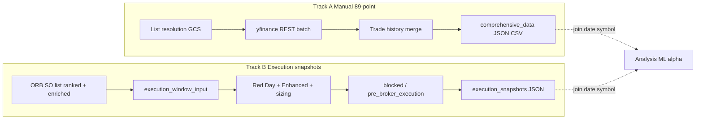

# Priority Optimizer — Comprehensive Guide

**Last updated:** April 16, 2026  
**Scope:** Manual 89-point collection, automated execution-time feature snapshots (including pre-gating `execution_window_input`, Rev 00334, plus Trendline execution snapshots), dataset strategy, and links to supporting documentation.

This document sits in the strategy **docs** tree and describes the **Priority Optimizer** subsystem under [`../priority_optimizer/`](../priority_optimizer/). For day-to-day commands and script names, the [priority optimizer README](../priority_optimizer/README.md) remains the quick reference.

---

## 1. Purpose

The Priority Optimizer exists to **measure what the trading system knew about each symbol** around signal collection and execution, and to **relate those measurements to outcomes** (rank, P&amp;L, exit quality, session profitability). That loop supports:

- **Priority rank formula tuning** (weights on VWAP distance, RS vs SPY, ORB volume, confidence, and related factors).
- **Red Day and risk gating** (portfolio-level patterns, enhanced detector, session context).
- **Exit and sizing research** (how ranks and technical context line up with peaks, stops, and holding time).

Historically this was driven by **manual batch jobs** that rebuild rich feature rows after the fact. The system now also writes **automated execution-time snapshots** so each session’s **exact pre-trade feature profile** is captured without a separate run.

---

## 2. Two complementary data tracks

Think of two pipelines that **share the same business goal** but differ in **when** data is captured and **how wide** the feature set is.

| Aspect | Track A: Manual 89-point collection | Track B: Automated execution snapshots |
|--------|-------------------------------------|----------------------------------------|
| **Trigger** | You run a script (or scheduled job) with a date | Production path at Red Day / execution gates |
| **Typical timing** | Anytime; uses a **nominal** signal time (e.g. 7:30 AM PT) for market replay | **Actual** instants: ORB execution-window input (before gating), ORB block paths / pre-broker, and Trendline execution fills |
| **Feature breadth** | **~89 fields** per symbol (full Priority Optimizer schema) | **Dual vectors per symbol:** compact `features_*` plus parallel **`features_89_*`** keyed by `feature_schema_89_keys`; top-level **Red Day / enhanced** context |
| **Outcome linkage** | Merges **trade history**, ORB, and ranking into one row where available | Designed to be **joined** to closes/EOD and Track A using `date` + `symbol` |
| **Primary scripts / modules** | [`collect_89points_fast.py`](../priority_optimizer/collect_89points_fast.py), [`ComprehensiveDataCollector`](../modules/comprehensive_data_collector.py) | [`execution_feature_snapshot.py`](../modules/execution_feature_snapshot.py), wired from [`prime_trading_system.py`](../modules/prime_trading_system.py) |

Neither track replaces the other: **Track A** is ideal for deep factor mining and backfill; **Track B** aligns with live gates and now includes both (a) ORB **`execution_window_input`** snapshots **before** portfolio Red Day / enhanced skip and (b) Trendline execution snapshots at successful fill time.



---

## 3. Track A — Manual feature collection (original design)

### 3.1 What it does

The manual flow **resolves the SO list for a calendar day**, fetches **broad technical and market data** (chiefly via REST / yfinance paths in the fast collector), and **combines** that with **execution and trade outcomes** where the comprehensive collector can resolve them. The advertised output is **89 data points per signal** (see [DATAPOINTS_SUMMARY.md](../priority_optimizer/docs/2026/Reference/DATAPOINTS_SUMMARY.md)).

### 3.2 Canonical SO list resolution

[`modules/signal_collection_gcs.py`](../modules/signal_collection_gcs.py) defines how a date’s **Standard Order** universe is loaded:

1. **`daily_markers/signal_collection_730/{YYYY-MM-DD}.json`** → `pending_so_signals` (preferred, merged cross-instance list).
2. **`priority_optimizer/daily_signals/{date}_signals.json`** (fallback).
3. **Root `daily_markers/{date}.json`** (further fallback).

This order matters for **reproducibility**: the same date should use the **same symbol set** the live system used at the 7:30 AM PT window when GCS markers exist.

### 3.3 Recommended command

From the repo:

```bash
cd "0. Strategies and Automations/1. The Easy ORB Strategy/priority_optimizer"
python3 collect_89points_fast.py --date YYYY-MM-DD
```

Outputs (typical):

- **Local:** `priority_optimizer/comprehensive_data/YYYY-MM-DD_comprehensive_data.json` and `.csv`
- **GCS:** `priority_optimizer/comprehensive_data/` on the configured bucket (see [CloudSecrets.md](CloudSecrets.md) or deployment config for the exact bucket name in your environment)

Supporting guides:

- [HOW_TO_USE.md](../priority_optimizer/docs/2026/Reference/HOW_TO_USE.md)
- [QUICK_COLLECTION_GUIDE.md](../priority_optimizer/docs/2026/Reference/QUICK_COLLECTION_GUIDE.md)
- [DATA_COLLECTION_INDEX.md](../priority_optimizer/docs/2026/Reference/DATA_COLLECTION_INDEX.md)

### 3.4 Other scripts and recovery

The [priority optimizer README](../priority_optimizer/README.md) tables **REST vs E*TRADE** variants, **retrieve** / **recover** utilities, and **reconstruction** from trade history. Use those when GCS or local files are partial or when you need a non-fast path.

### 3.5 In-app collectors

The main application also records priority-related data during runs (see `modules/priority_data_collector.py`, `modules/comprehensive_data_collector.py`, `modules/daily_run_tracker.py`, and 0DTE counterparts). Manual collection remains the **standard** for **offline analysis packs** with a fixed schema per day.

---

## 4. Track B — Automated execution-time snapshots (Rev 00333, Rev 00334)

### 4.1 Why this exists

Manual 89-point runs are powerful but **operator-dependent** and can drift slightly from **exact** live state (timing, enrichment order, last-minute gating). Automated snapshots record **the same dictionaries** the executor saw (or would have seen) at **defined gates**, including **Red Day metrics** and **enhanced Red Day risk assessment** objects.

### 4.1.1 Snapshot scope — ORB SO and Trendline execution paths

The automated execution snapshot covers two strategy-tagged paths:

- **ORB SO path** (`snapshot_strategy=easy_orb_etf_so`): per-symbol rows are built from the **ORB Signal Collection list** passed into Step 5 — the same merged `pending_so_signals` / 7:30 execution payload (see `daily_markers/signal_collection_730/`), **not**:
  - the full `core_list.csv` watchlist,
  - “all symbols scanned” during 7:15–7:30 (those are not written as feature rows),
  - 0DTE signal collection / Convex rows.
- **Trendline execution path** (`snapshot_strategy=easy_trendline_0dte`): per-symbol row is emitted at successful Trendline options execution (`stage=trendline_options_executed`) with execution metadata and strategy tags for downstream joins.

**Naming in the JSON — depends on `stage`:**

- **`execution_window_input`:** `features_full_pool` is the **ranked, enriched SO list immediately before** portfolio Red Day and enhanced detector runs. `signal_count_selected` is **0**; there is no sized “selected” set yet. Use this file for **dataset coverage on blocked days** and for features **unchanged by gating**. **`red_day` / `enhanced_red_day` in this file are not the post-gate truth** (e.g. `portfolio_pattern_triggered` is not set from the detector yet); use **`blocked_*`** or **`pre_broker_execution`** for final gating context.
- **`pre_broker_execution`:** `features_full_pool` is the full ranked SO pool **after** gating and adaptive filters that ran before sizing; `features_selected` / `symbols_selected` match the **batch-sized executable** subset.
- **`blocked_*` stages:** `features_full_pool` is the SO pool at that decision point (see table below).

In all cases, the pool is **not** the full `core_list.csv` watchlist as rows — only SO Signal Collection path symbols.

**`market_context.total_scanned`:** This is the **collection scan count** (how many symbols were evaluated in the SO window), stored for context. It is **not** the length of `features_full_pool`. Compare `signal_count_full_pool` to your SO Signal Collection alert count.

Use cases:

- **Session labels:** Link “what the basket looked like” to **portfolio-level** P&amp;L the same day.
- **Per-symbol alpha:** Join `features_selected` to **realized P&amp;L** and **max favorable / adverse** excursion when you add those from trade logs.
- **Unprofitable regimes:** Train or rule-mine on days where **`pre_broker_execution`** snapshots show high risk scores yet trades still fired (or the opposite).

### 4.2 When snapshots are written

| `stage` (filename token) | Meaning |
|---------------------------|---------|
| `execution_window_input` | **Rev 00334:** SO pool **after** rank + duplicate guard + technical enrichment, **before** portfolio Red Day and enhanced skip. `selected` arrays empty. Ensures feature capture even when execution stops at the next gate. |
| `blocked_portfolio_red_day` | Portfolio Red Day pattern fired; signals cleared for ORB execution; **full SO collection pool** preserved in the snapshot before drops. |
| `blocked_enhanced_skip_execution` | Enhanced detector returned **SKIP_EXECUTION**; full **SO collection** list at that decision. |
| `pre_broker_execution` | Normal ORB path: **after** batch sizing, **immediately before** broker execution; includes **executable** subset plus **full ranked SO collection pool** at that point (not core_list). |
| `trendline_options_executed` | Trendline 0DTE path: snapshot at successful options execution time, tagged with `snapshot_strategy=easy_trendline_0dte` and execution metadata in `extra` (trade id, setup/trigger, option side, slot sizing, entry context). |

Each run uses a **unique filename** so retries and multiple writes per day do not overwrite:  
`YYYY-MM-DD_HHMMSS_{stage}.json`

### 4.3 Payload schema (`schema_version` 1)

Top-level keys (see [`execution_feature_snapshot.py`](../modules/execution_feature_snapshot.py) for the source of truth):

- **`schema_version`**, **`date`**, **`captured_at_pt`**, **`stage`**, **`snapshot_strategy`**
- **`market_context`:** `spy_momentum_pct`, `vix_level`, `total_scanned` (SO scan universe size — **not** the number of rows in `features_full_pool`)
- **`red_day`:** `execution_blocked_by_portfolio_flag`, `portfolio_pattern_triggered`, `reason`, `metrics`
- **`enhanced_red_day`:** serialized **`RedDayRiskAssessment`** (dataclass → dict), or `null`
- **`signal_count_full_pool`**, **`signal_count_selected`**
- **`symbols_full_pool`**, **`symbols_selected`**
- **`features_full_pool`**, **`features_selected`:** arrays of per-symbol **compact** records (execution-oriented slice).
- **`feature_schema_89_keys`:** ordered list of keys for the wide vector.
- **`features_89_full_pool`**, **`features_89_selected`:** parallel arrays of per-symbol dicts aligned to `feature_schema_89_keys` (sparse / partial fill where a field is missing on the signal).

Per-symbol compact records include among others:  
`symbol`, `side`, `price`, `current_price`, `confidence`, `priority_score`, `priority_rank`, `rsi`, `macd_histogram`, `volume_ratio`, `orb_volume_ratio`, `rs_vs_spy`, `vwap_distance_pct`, ORB high/low/range, `volume_color`, `quantity`, `position_size_pct`, `risk_reduction_applied`.

**`extra`** varies by stage (e.g. deployed capital, capital efficiency, enhanced recommendation on block paths).

### 4.4 Storage

- **GCS:** `gs://{GCS_BUCKET_NAME}/priority_optimizer/execution_snapshots/{filename}.json`  
  Default bucket in code is `easy-etrade-strategy-data` when `GCS_BUCKET_NAME` is unset; upload only when [`modules/gcs_persistence.py`](../modules/gcs_persistence.py) initializes successfully (`gcs.enabled`).
- **Local (container):** `/app/priority_optimizer/execution_snapshots/` in Cloud Run (ephemeral unless you copy out). For local runs, same path relative to repo root.

After each successful write, **retention pruning** keeps roughly the last **`EXECUTION_SNAPSHOT_KEEP_SESSIONS`** distinct **session dates** (by filename date prefix) in local folder and GCS prefix.

Local JSON files are **gitignored** in-repo (see [`priority_optimizer/.gitignore`](../priority_optimizer/.gitignore)); the folder is kept via `.gitkeep`. Use [`retrieve_execution_snapshots.py`](../priority_optimizer/retrieve_execution_snapshots.py) to pull GCS objects to `priority_optimizer/retrieved_data/execution_snapshots/`.

### 4.5 Configuration

- **`ENABLE_EXECUTION_FEATURE_SNAPSHOT`** in [`configs/Shared.env`](../configs/Shared.env) — default **true**. Set to `false` to disable writes (no effect on trading logic beyond I/O).
- **`EXECUTION_SNAPSHOT_KEEP_SESSIONS`** — default **50** (from code fallback in [`execution_feature_snapshot.py`](../modules/execution_feature_snapshot.py)); can be set via runtime environment/config override. Prunes older session-date groups of snapshot files (local + GCS when enabled).

### 4.6 Operations: finding snapshots in Cloud Logging

Search logs for:

1. **`EXECUTION_FEATURE_SNAPSHOT_ATTEMPT | stage=... | pool=... | selected=... | gcs=... | local=...`** — emitted from [`prime_trading_system.py`](../modules/prime_trading_system.py) immediately after each snapshot attempt (confirms orchestrator invoked the writer and shows resolved paths, including `gcs=None` when upload did not occur).

2. **`EXECUTION_FEATURE_SNAPSHOT | stage=... | gcs=... | local=... | pool=... | selected=...`** — emitted from [`execution_feature_snapshot.py`](../modules/execution_feature_snapshot.py) after `persist_execution_snapshot` completes local write / GCS upload.

Use the **gcs** path (when non-empty) to pull objects into analysis or BigQuery.

### 4.7 Local retrieval (Python version)

The retriever imports app modules that use `dataclass(slots=True)`; use **Python 3.10+** (e.g. `python3.11`) when running:

```bash
python3.11 priority_optimizer/retrieve_execution_snapshots.py --date YYYY-MM-DD
```

---

## 5. Using both tracks for ML profiling and alpha prioritization

This section describes **intent** and **data hygiene**, not a committed model pipeline.

### 5.1 Labeling

- **Symbol-level labels:** Realized P&amp;L, hold time, exit reason, peak capture (from mock/live trade history or 89-point merge).
- **Session-level labels:** Sum of SO P&amp;L, hit rate, drawdown intraday — derived from the same day’s closes.

### 5.2 Join keys

- **Primary:** `date` (Pacific session date as stored) + `symbol`.
- **Secondary:** `priority_rank` / `trade_id` when you align execution snapshots to specific orders in logs.

### 5.3 Feature sets

- **Wide baseline:** Track A 89-point rows for factor discovery and redundancy analysis.
- **Decision-aligned:** Track B — use **`execution_window_input`** for ORB features **before** Red Day/enhanced gates; use **`pre_broker_execution`** for ORB features **after** gating plus sized **selected** rows; use **`trendline_options_executed`** for Trendline 0DTE execution-time rows.

### 5.4 Suggested analysis order

1. **Descriptive:** Distributions of VWAP distance, RS vs SPY, and volume ratio **by rank and by P&amp;L quartile** on days with both tracks.
2. **Session risk:** Compare `enhanced_red_day.composite_risk_score` and `red_day.metrics` to **session P&amp;L** (when execution still occurred).
3. **Modeling:** Start with interpretable models (regularized linear, shallow trees) on Track B + labels; use Track A to **expand** factors once a hypothesis is stable.

Session writeups and formula notes already live under [priority_optimizer/docs/2026/Jan7 Session/](../priority_optimizer/docs/2026/Jan7%20Session/) (e.g. Red Day analysis and priority formula reviews).

---

## 6. GCS layout (reference)

Under the project bucket (name varies by deployment; see your env / CloudSecrets):

- `priority_optimizer/comprehensive_data/` — 89-point outputs
- `priority_optimizer/daily_signals/` — derived daily signal JSON (fallback source)
- `priority_optimizer/execution_snapshots/` — automated execution-time snapshots (Rev 00333 / 00334)
- `daily_markers/signal_collection_730/` — authoritative merged SO payload for the session

---

## 7. Related documentation index

| Document | Role |
|----------|------|
| [../priority_optimizer/README.md](../priority_optimizer/README.md) | Scripts, quick start, 89-point summary |
| [../priority_optimizer/docs/2026/README.md](../priority_optimizer/docs/2026/README.md) | Doc hub for 2026 |
| [../priority_optimizer/docs/2026/Reference/DATA_COLLECTION_INDEX.md](../priority_optimizer/docs/2026/Reference/DATA_COLLECTION_INDEX.md) | Collection index and schedules |
| [../priority_optimizer/docs/2026/Reference/INTEGRATION_AUTOMATIC_COLLECTION.md](../priority_optimizer/docs/2026/Reference/INTEGRATION_AUTOMATIC_COLLECTION.md) | Automatic collection integration |
| [../priority_optimizer/docs/2026/Reference/DATAPOINTS_SUMMARY.md](../priority_optimizer/docs/2026/Reference/DATAPOINTS_SUMMARY.md) | 89 datapoints reference |
| [Data.md](Data.md) / [Cloud.md](Cloud.md) | Broader strategy data and cloud behavior |

---

## 8. Summary

- The **Priority Optimizer** is both a **manual 89-point laboratory** and an **automated execution-time recorder** for ORB SO gate snapshots and Trendline 0DTE execution snapshots. Track B remains strategy-tagged and does not store full watchlist rows.
- **Manual collection** remains the standard for **dense, comparable daily files** and historical backfill.
- **Execution snapshots** anchor research to **defined moments** (pre-gating input, block decisions, pre-broker), which is critical for **alpha attribution** and **unprofitable-session detection**.
- Together they form the dataset backbone for **improving rank formulas**, **tightening risk gates**, and **quantifying which technical signatures matter** for your largest winners and losers.
