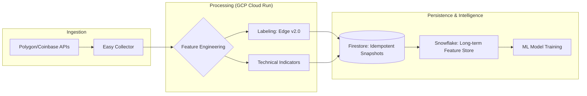

# Easy Collector

**High-Fidelity Data Orchestration & MLOps Pipeline for Real-Time Decision Systems.**

---

### Executive Impact

- **98% API Cost Efficiency:** Architected a two-layer caching strategy reducing calls from 336/day to ~5/day.
- **Production-Grade Integrity:** Implemented an idempotent persistence layer with a 10-point automated data-quality gate.
- **ML-Ready Feature Engineering:** Automated the extraction of edge-based labels (v2.0) for US 0DTE and Crypto Futures.

---

### New here?

| Goal | Where to go |
|------|-------------|
| **Run locally** | [Quick Start](#quick-start) |
| **Deploy to Cloud Run** | [Deployment](#deployment) |
| **Set up Cloud Scheduler** | [Cloud Scheduler Setup](#cloud-scheduler-setup) |
| **Secrets & API keys** | [SECRETS.md](SECRETS.md) |
| **Production details & verification** | [EXECUTIVE_SUMMARY.md](EXECUTIVE_SUMMARY.md) |
| **Troubleshoot data sources** | [docs/DATA_SOURCES_TROUBLESHOOTING.md](docs/DATA_SOURCES_TROUBLESHOOTING.md) |

---

## Overview

Easy Collector is a **distributed systems** data pipeline that runs standalone (no ORB/0DTE trading code). It fetches market data via **Polygon** (US primary), **Coinbase** (crypto), and fallbacks; computes technical indicators and edge-based outcome labels; and writes idempotent snapshots to **Firestore** with **feature store consistency** guarantees. Designed for GCP Cloud Run and Cloud Scheduler, with **latency optimization** through a two-layer cache and batch prefetch.

### System flow



### Purpose

For **US 0DTE**, Easy Collector is optimized to learn:
- Directional bias after the market open
- Which setups produce early, sustained moves (best delta capture)
- Which conditions lead to chop, decay, or low-expectancy days to avoid

For **crypto futures**, Easy Collector is optimized to learn:
- Which session opening ranges (London, US, Asia, Reset) predict the largest directional price expansions
- Continuation vs reversal behavior between sessions
- The technical signatures that precede high-distance long or short moves

### Key Features

- ✅ **Unified Master Schema**: Single datapoint structure for both ORB and Ichimoku strategies
- ✅ **Idempotent Collection**: Deterministic document IDs prevent duplicate snapshots
- ✅ **Holiday Awareness**: Automatic detection of US holidays, low-volume days, and early closes
- ✅ **Session-Based Crypto Collection**: London, US, Reset, and Asia session support
- ✅ **Dry-Run Mode**: Test collection without writing to Firestore
- ✅ **Cloud Run Ready**: Designed for serverless deployment with Cloud Scheduler
- ✅ **US Cache Layer**: Prefetch once per day, 98% API call reduction
- ✅ **Two-Layer Data Design:** Latency optimization via indicator slab + snapshot window; consistent feature store semantics
- ✅ **Edge-Based Labels**: Consistent, interpretable label formulas (`edge = MFE - k*MAE - cost_penalty`)
- ✅ **Data Governance:** 10 automated quality gates for dataset ground-truth integrity
- ✅ **Session VWAP**: Computes VWAP from session start (not full history)

## Architecture

The pipeline is built for **latency optimization** (batch prefetch, in-memory cache) and **feature store consistency** (idempotent document IDs, deterministic snapshot keys). Components run on GCP Cloud Run as a serverless **distributed systems** topology.

```
┌─────────────────┐
│ Cloud Scheduler │ (Triggers collection)
└────────┬────────┘
         │
         ▼
┌─────────────────┐
│   FastAPI App   │ (main.py - REST endpoints)
└────────┬────────┘
         │
         ▼
┌─────────────────┐
│ Snapshot Service│ (Orchestrates collection)
└────────┬────────┘
         │
    ┌────┴────┐
    ▼         ▼
┌────────┐ ┌──────────┐
│US Cache│ │ Coinbase │ (Market data clients)
│  Layer │ │  Client  │
└────────┘ └──────────┘
    │         │
    │    ┌────┴────┐
    │    ▼         ▼
    │┌────────┐ ┌──────────┐
    ││ Polygon│ │ Coinbase │ (Data fetching)
    ││yfinance│ │  Client  │
    │└────────┘ └──────────┘
    │
    ▼
┌─────────────────┐
│ Indicator Service│ (Technical indicators)
└────────┬────────┘
         │
         ▼
┌─────────────────┐
│Outcome Label    │ (Edge-based labels)
│    Service      │
└────────┬────────┘
         │
         ▼
┌─────────────────┐
│ Firestore Repo  │ (Persistent storage)
└─────────────────┘
```

**Key Components**:
- **US provider router**: Polygon (primary, `POLYGON_API_KEY`), then Alpaca, then yfinance. `us_provider_router` runs healthcheck and picks the first healthy client; prefetch and collection use that client.
- **US Cache Layer:** Prefetches 2 days of data once per day via the active US client (Polygon when healthy, else yfinance), caches for all snapshots (98% API call reduction; latency optimization for distributed collection runs).
- **Two-Layer Data Design**: Indicator slab (120 bars) + Snapshot window (small window for ORB metrics)
- **Edge-Based Labels**: Consistent `edge = MFE - k*MAE - cost_penalty` formula across all labels

## Quick Start

### 1. Environment and secrets

For **local runs**, put API keys in `secretsprivate/.env` (loaded automatically). One-time setup:

```bash
./scripts/setup_local_secrets.sh   # creates secretsprivate/.env from .env.example
```

Then edit `secretsprivate/.env` and set `POLYGON_API_KEY` (you can reuse from Ultima Bot `backend/.env`). For deploy, use Secret Manager; see **`SECRETS.md`**.

Optional env (or in `secretsprivate/.env`):

```bash
# GCP (or leave defaults)
GCP_PROJECT_ID=your-project-id
GCP_REGION=us-central1
USE_FIRESTORE_EMULATOR=false  # true for local emulator

# US: Polygon primary (POLYGON_API_KEY in secretsprivate/.env or Secret Manager)
# Crypto: Coinbase OHLCV needs no auth

# Service
TIMEFRAME=5m
INDICATOR_LOOKBACK_BARS=120
DRY_RUN=false  # true to test without Firestore writes
```

### 2. Local Development

#### Using Firestore Emulator

```bash
# Install dependencies
pip install -r requirements.txt

# Start Firestore emulator (if not already running)
gcloud emulators firestore start --host-port=localhost:8080

# Set environment variable
export USE_FIRESTORE_EMULATOR=true
export FIRESTORE_EMULATOR_HOST=localhost:8080

# Run service
cd backend
uvicorn app.main:app --reload --host 0.0.0.0 --port 8080
```

#### Without Emulator (uses real Firestore)

```bash
# Authenticate with GCP
gcloud auth application-default login

# Run service
cd backend
uvicorn app.main:app --reload --host 0.0.0.0 --port 8080
```

### 3. Testing Endpoints

#### Health Check

```bash
curl http://localhost:8080/health
```

#### Collect US ORB Snapshots (Dry-Run)

```bash
curl -X POST http://localhost:8080/collect/us/orb \
  -H "Content-Type: application/json" \
  -d '{}'
```

#### Collect Crypto US Session ORB Snapshots

```bash
curl -X POST http://localhost:8080/collect/crypto/US/orb \
  -H "Content-Type: application/json" \
  -d '{}'
```

To confirm crypto snapshots end-to-end: `./scripts/test_crypto_snapshot.sh [BASE_URL]` (runs product_smoke + POST /collect/crypto/US/orb).

## Deployment

### Cloud Run Deployment

Collector deploys **standalone** (~800K upload). No ORB/0DTE code is included.

**Before first deploy:** Create `polygon-api-key` in Secret Manager and grant the Cloud Run SA `roles/secretmanager.secretAccessor`. Run `./scripts/check_polygon_secret_ready.sh` to verify; optionally `--validate-key` to test the key against Polygon. See **`SECRETS.md`**. For local dev: `scripts/setup_local_secrets.sh` or `secretsprivate/.env` with `POLYGON_API_KEY`.

#### 1. Deploy (build + Cloud Run)

From **ORB Strategy root**:

```bash
./deploy-collector.sh
```

This copies `data/watchlist/0dte_list.csv` into `easyCollector/`, builds the image, and deploys to Cloud Run with `POLYGON_API_KEY` from Secret Manager (`polygon-api-key:latest`). Build only: `./deploy-collector.sh --build-only`.

#### 2. Deploy only (image already built)

```bash
cd easyCollector && ./scripts/deploy.sh
```

Uses `--set-secrets=POLYGON_API_KEY=polygon-api-key:latest`. See [docs/SNAPSHOT_COLLECTION_READINESS.md](docs/SNAPSHOT_COLLECTION_READINESS.md) and [SECRETS.md](SECRETS.md) for details.

#### 3. Health and smoke checks (before next snapshots)

**Polygon (US) + Coinbase (Crypto):**

```bash
# Secret Manager + IAM (before or after deploy):
./scripts/check_polygon_secret_ready.sh
./scripts/check_polygon_secret_ready.sh --validate-key   # also test key vs Polygon API (SM, .env, or --key=YOUR_KEY)
./scripts/validate_polygon_key.sh --key=YOUR_KEY         # test a new key before adding to Secret Manager

# Running service: Polygon key for US snapshots and Coinbase for crypto:
./scripts/check_polygon_coinbase.sh
./scripts/check_polygon_coinbase.sh https://YOUR-SERVICE-URL.run.app
```

Full health + smoke:

```bash
./scripts/check_health.sh
./scripts/check_health.sh https://YOUR-SERVICE-URL.run.app
```

Smoke only (debug endpoints):

```bash
./scripts/smoke_test.sh "https://YOUR-SERVICE-URL.run.app"
```

Or `curl` the debug endpoints (replace `BASE` with your service URL):

- `curl "BASE/debug/us/provider_smoke?symbol=SPY&bars=50"` — expect `provider=polygon`, `row_count` ~50
- `curl "BASE/debug/polygon"` — when US fails: `polygon_api_key_set`, `polygon_healthcheck` (key missing vs API error)
- `curl "BASE/debug/crypto/product_smoke?symbol=BTC-PERP"` — expect `resolved_product_id=BTC-USD`, `candle_row_count` > 0

Full validation: `python scripts/validate_snapshot_collection.py --tier1-only` (requires deps and `secretsprivate/.env`).

#### US provider: Polygon (default)

US data uses **Polygon** as primary (`POLYGON_API_KEY` from `secretsprivate/.env` or Secret Manager). Fallbacks: Alpaca, then yfinance. E*TRADE is not used.

### Cloud Scheduler Setup

#### US Market Snapshots

```bash
# US ORB (9:45 ET weekdays)
gcloud scheduler jobs create http us-orb-collect \
  --location=us-central1 \
  --schedule="45 9 * * 1-5" \
  --time-zone="America/New_York" \
  --uri="https://easy-collector-XXXXX.run.app/collect/us/orb" \
  --http-method=POST \
  --headers="Content-Type=application/json" \
  --message-body='{}'

# US SIGNAL (10:30 ET weekdays)
gcloud scheduler jobs create http us-signal-collect \
  --location=us-central1 \
  --schedule="30 10 * * 1-5" \
  --time-zone="America/New_York" \
  --uri="https://easy-collector-XXXXX.run.app/collect/us/signal" \
  --http-method=POST \
  --headers="Content-Type=application/json" \
  --message-body='{}'

# US OUTCOME (15:55 ET weekdays)
gcloud scheduler jobs create http us-outcome-collect \
  --location=us-central1 \
  --schedule="55 15 * * 1-5" \
  --time-zone="America/New_York" \
  --uri="https://easy-collector-XXXXX.run.app/collect/us/outcome" \
  --http-method=POST \
  --headers="Content-Type=application/json" \
  --message-body='{}'
```

#### Crypto Market Snapshots

```bash
# Crypto London ORB (03:15 ET daily)
gcloud scheduler jobs create http crypto-london-orb \
  --location=us-central1 \
  --schedule="15 3 * * *" \
  --time-zone="America/New_York" \
  --uri="https://easy-collector-XXXXX.run.app/collect/crypto/LONDON/orb" \
  --http-method=POST \
  --headers="Content-Type=application/json" \
  --message-body='{"session": "LONDON"}'

# Crypto US ORB (08:15 ET daily)
gcloud scheduler jobs create http crypto-us-orb \
  --location=us-central1 \
  --schedule="15 8 * * *" \
  --time-zone="America/New_York" \
  --uri="https://easy-collector-XXXXX.run.app/collect/crypto/US/orb" \
  --http-method=POST \
  --headers="Content-Type=application/json" \
  --message-body='{"session": "US"}'

# Crypto Reset ORB (17:15 ET daily)
gcloud scheduler jobs create http crypto-reset-orb \
  --location=us-central1 \
  --schedule="15 17 * * *" \
  --time-zone="America/New_York" \
  --uri="https://easy-collector-XXXXX.run.app/collect/crypto/RESET/orb" \
  --http-method=POST \
  --headers="Content-Type=application/json" \
  --message-body='{"session": "RESET"}'

# Crypto Asia ORB (19:15 ET daily)
gcloud scheduler jobs create http crypto-asia-orb \
  --location=us-central1 \
  --schedule="15 19 * * *" \
  --time-zone="America/New_York" \
  --uri="https://easy-collector-XXXXX.run.app/collect/crypto/ASIA/orb" \
  --http-method=POST \
  --headers="Content-Type=application/json" \
  --message-body='{"session": "ASIA"}'
```

## Schedule Reference

### US Market Snapshots

| Snapshot Type | Time (ET) | Schedule | Description |
|--------------|-----------|----------|-------------|
| ORB | 9:45 AM | Weekdays | Opening Range Breakout (ORB window: 9:30-9:45) |
| SIGNAL | 10:30 AM | Weekdays | Pre-execution signal (10:15-10:30) |
| OUTCOME | 3:55 PM | Weekdays | Pre-close outcome (5 min before 4:00 PM close, or early close - 5 min) |

### Crypto Market Snapshots

| Session | Open (ET) | ORB Time | SIGNAL Time | OUTCOME Time |
|---------|-----------|----------|-------------|--------------|
| London | 3:00 AM | 3:15 AM | 4:00 AM | 2:55 AM (next day) |
| US | 8:00 AM | 8:15 AM | 9:00 AM | 4:55 PM |
| Reset | 5:00 PM | 5:15 PM | 6:00 PM | 6:55 PM |
| Asia | 7:00 PM | 7:15 PM | 8:00 PM | 2:55 AM (next day) |

**Next Session Mapping:**
- London → US
- US → Reset
- Reset → Asia
- Asia → London (next day)

## Symbols

### US 0DTE Symbols (~100+ total)

Loaded from: `data/watchlist/0dte_list.csv`

**Tier 1 Symbols** (Primary targets):
- **Indices**: SPX (uses SPY proxy for intraday), SPY, QQQ, IWM
- **ETFs**: MAGS, VIX, IBIT, GLD, SLV
- **Leveraged ETFs**: SPYU, SPXL, UPRO, TQQQ, SOXL, etc.

**Tier 2 Symbols** (Mega-cap/Institutional):
- **Tech**: NVDA, AMD, TSLA, META, AMZN, AAPL, MSFT, GOOGL, AVGO, SMCI
- **ETFs**: SMH, GDX, TSLL, MULL, AVGG, etc.
- **Trading Favorites**: COIN, HOOD, PLTR, QCOM, MU, PWR, VST, OKLO, CRWV, SOFI, HIMS, DAL, AAL, RGTI

**Note**: Symbols are loaded from CSV with tier prioritization. SPX uses SPY as proxy for intraday data with 10x scaling.

### Crypto Futures Symbols (4 total)

**Perpetual Futures:** BTC-PERP, ETH-PERP, SOL-PERP, XRP-PERP

## Data Model

### Snapshot Document ID Format

```
{market}_{symbol}_{session}_{snapshot_type}_{YYYYMMDD}_{HHMM_ET}
```

**Examples:**
- `US_SPY_ORB_20250108_0945_ET`
- `CRYPTO_BTC-PERP_US_ORB_20250108_0815_ET`

### Firestore Collections

- **`snapshots`**: Individual snapshot documents (idempotent IDs)
- **`runs`**: Collection run logs (counts, durations, errors)

## Dry-Run Mode

Enable dry-run mode to test collection without writing to Firestore:

```bash
export DRY_RUN=true
```

In dry-run mode:
- Full pipeline runs (data fetch, indicators, snapshot building)
- Snapshots are logged but NOT written to Firestore
- Run logs are NOT created
- Useful for testing and debugging

## Early Close Handling

US market early close days are automatically detected:
- **Independence Day Eve** (July 3): 1:00 PM ET close → OUTCOME at 12:55 PM ET
- **Black Friday**: 1:00 PM ET close → OUTCOME at 12:55 PM ET
- **Christmas Eve** (Dec 24): 1:00 PM ET close → OUTCOME at 12:55 PM ET

Early close times are calculated dynamically based on holiday calendar.

## Holiday Awareness

Easy Collector automatically tags snapshots with:
- `is_market_closed`: True if US market holiday (no trading)
- `is_low_volume_holiday`: True if low-volume day (trading disabled)
- `is_early_close`: True if early close day
- `early_close_time_et`: Early close time (HH:MM format)
- `is_macro_event_day`: True if macro event day (stub - configurable)
- `is_fed_day`: True if FOMC announcement day (stub - configurable)

## API Reference

### Endpoints

- `GET /health` - Health check
- `GET /version` - Service version
- `GET /debug/us/provider_smoke?symbol=SPY&bars=50` - US (Polygon) smoke: `provider`, `row_count`, `last_close`
- `GET /debug/crypto/product_smoke?symbol=BTC-PERP` - Crypto (Coinbase) smoke: `resolved_product_id`, `candle_row_count`
- `POST /collect/us/orb` - Collect US ORB snapshots
- `POST /collect/us/signal` - Collect US SIGNAL snapshots
- `POST /collect/us/outcome` - Collect US OUTCOME snapshots
- `POST /collect/crypto/{session}/orb` - Collect crypto ORB snapshots
- `POST /collect/crypto/{session}/signal` - Collect crypto SIGNAL snapshots
- `POST /collect/crypto/{session}/outcome` - Collect crypto OUTCOME snapshots

### Request Format

```json
{
  "timestamp_et": "2025-01-08 09:45:00"  // Optional, defaults to now
}
```

### Response Format

```json
{
  "success": true,
  "market": "US",
  "snapshot_type": "ORB",
  "summary": {
    "total_snapshots": 30,
    "successful": 28,
    "failed": 2,
    "errors": ["SYMBOL1: No OHLCV data", "SYMBOL2: API timeout"],
    "duration_seconds": 45.2
  }
}
```

## Development

### Project Structure

```
easyCollector/
├── backend/
│   └── app/
│       ├── main.py              # FastAPI app
│       ├── config.py            # Configuration
│       ├── clients/             # Market data clients
│       │   ├── base_client.py
│       │   ├── polygon_client.py   # US primary (Polygon.io)
│       │   ├── yfinance_client.py  # US fallback
│       │   ├── us_provider_router.py  # Healthcheck, Polygon→Alpaca→yfinance
│       │   └── coinbase_client.py
│       ├── models/              # Pydantic models
│       │   └── snapshot_models.py
│       ├── services/            # Business logic
│       │   ├── calendar_service.py
│       │   ├── indicator_service.py
│       │   ├── outcome_label_service.py  # Edge-based label formulas
│       │   └── snapshot_service.py
│       ├── storage/             # Data persistence & caching
│       │   ├── firestore_repo.py
│       │   ├── local_repo.py
│       │   └── us_intraday_cache.py  # US market cache layer
│       └── utils/               # Utilities
│           └── time_utils.py
├── scripts/                     # Utility scripts
│   ├── validate_snapshot_collection.py  # Full US + crypto validation
│   ├── smoke_test.sh            # US (Polygon) + Crypto (Coinbase) smoke
│   ├── check_secret_manager.sh       # List secrets, check polygon-api-key
│   ├── check_polygon_secret_ready.sh # Secret + IAM + deploy wiring; --validate-key, --key= to test Polygon
│   ├── validate_polygon_key.sh       # Test Polygon key only (--key=, .env, or env); no SM/deploy checks
│   ├── check_polygon_coinbase.sh     # /debug/us/provider_smoke + /debug/crypto/product_smoke
│   ├── download_firestore_rest.py    # Download snapshots + run_logs from Firestore
│   └── setup_local_secrets.sh        # secretsprivate/.env from .env.example
├── secretsprivate/              # Local secrets (gitignored .env); sync: ensure_secret_manager_polygon.sh
├── requirements.txt
├── Dockerfile
└── README.md
```

### Testing

```bash
# Run tests (when implemented)
pytest tests/

# Test with dry-run
DRY_RUN=true python -m pytest tests/
```

## Troubleshooting

### Data sources (Polygon / Coinbase) — snapshots not succeeding

If **US** or **Crypto** snapshots fail, ensure data sources are working. From the **ORB root** (parent of easyCollector):

```bash
./easyCollector/scripts/ensure_data_sources_ready.sh           # diagnose
./easyCollector/scripts/ensure_data_sources_ready.sh --fix-iam # diagnose + grant IAM if missing
```

No need to `cd easyCollector`. See [docs/DATA_SOURCES_TROUBLESHOOTING.md](docs/DATA_SOURCES_TROUBLESHOOTING.md) for the full checklist (Secret Manager, IAM, redeploy, `volume_delta`, Coinbase).

### Comprehensive Logging

Easy Collector includes comprehensive logging at every step. See [docs/Sessions/Jan21 Session/LOGGING_GUIDE.md](docs/Sessions/Jan21%20Session/LOGGING_GUIDE.md) for:
- Log levels and flow
- OHLCV fetching logs (Polygon, yfinance, cache hits)
- Symbol loading logs
- Indicator calculation logs
- Snapshot building logs
- Firestore saving logs
- Troubleshooting steps

### Firestore Connection Issues

```bash
# Check authentication
gcloud auth application-default login

# Test Firestore access
gcloud firestore collections list --project easy-etrade-strategy
```

### Market Data Client Issues

Check health endpoint:
```bash
curl http://localhost:8080/health
```

### Monitor Cloud Run Logs

```bash
gcloud logging tail "resource.type=cloud_run_revision AND resource.labels.service_name=easy-collector" \
  --project easy-etrade-strategy
```

### Dry-Run Testing

Use dry-run mode to verify collection without Firestore writes:
```bash
export DRY_RUN=true
curl -X POST http://localhost:8080/collect/us/orb -d '{}'
```

### Data Download and Verification

```bash
cd easyCollector
python3 scripts/download_firestore_rest.py --days 1 --verify
```

This downloads snapshots and verifies data completeness.

## Data Analysis

After collecting snapshots, download and analyze the data:

**Download Data from Firestore:**
```bash
cd easyCollector
python3 scripts/download_firestore_rest.py --days 1 --verify
```

This script:
- Downloads snapshots from Firestore
- Verifies data completeness
- Saves data for analysis

**Data Structure:**
- Each snapshot contains 89+ technical indicators
- Snapshots are tagged with `run_id` for grouping
- Session bounds are explicitly recorded
- Outcome labels include MFE/MAE, opportunity scores, trade quality

**Session docs:** [docs/Sessions/Jan21 Session/DATA_COLLECTION_REVIEW.md](docs/Sessions/Jan21%20Session/DATA_COLLECTION_REVIEW.md), [LOGGING_GUIDE.md](docs/Sessions/Jan21%20Session/LOGGING_GUIDE.md).

## Current status

| Area | Status |
|------|--------|
| **Readiness** | Production ready — Cloud Run, Cloud Scheduler, Firestore |
| **US data** | Polygon (primary), Alpaca/yfinance fallback; two-layer cache ~98% API call reduction |
| **Crypto data** | Coinbase Exchange (OHLCV, no auth) |
| **Symbols** | US: 111+ from `0dte_list.csv` (Tier 1/2); Crypto: BTC-PERP, ETH-PERP, SOL-PERP, XRP-PERP |
| **Storage** | Firestore (`snapshots`, `runs`); idempotent doc IDs; feature store consistency |
| **Labels** | Edge-based v2.0 (`edge = MFE - k*MAE - cost_penalty`) |

### Data Governance & Quality Engineering

Automated quality gates (10-item checklist) ensure dataset ground-truth integrity before and after persistence. Run validation via `scripts/validate_snapshot_collection.py`. For the full checklist and production metrics, see **[EXECUTIVE_SUMMARY.md](EXECUTIVE_SUMMARY.md)**.

## Documentation

| Doc | Purpose |
|-----|---------|
| **[EXECUTIVE_SUMMARY.md](EXECUTIVE_SUMMARY.md)** | Production-grade updates, verification, label formulas, performance |
| **[SECRETS.md](SECRETS.md)** | API keys, Secret Manager, deploy secrets |
| **[Data.md](Data.md)** | Data model and collection overview |
| **[docs/DATA_SOURCES_TROUBLESHOOTING.md](docs/DATA_SOURCES_TROUBLESHOOTING.md)** | Polygon/Coinbase troubleshooting, IAM, 0-snapshot fixes |
| **[docs/SNAPSHOT_COLLECTION_READINESS.md](docs/SNAPSHOT_COLLECTION_READINESS.md)** | Snapshot collection readiness |
| **docs/Sessions/** | Jan16, Jan21, Jan22 session notes (deployment, logging, labels, verification) |

## License

Internal use only — Easy Trading Software.

## Support

For issues or questions, contact the Easy Trading Software development team.

---

*README last updated: February 2026. For production-grade changes and verification, see [EXECUTIVE_SUMMARY.md](EXECUTIVE_SUMMARY.md).*
